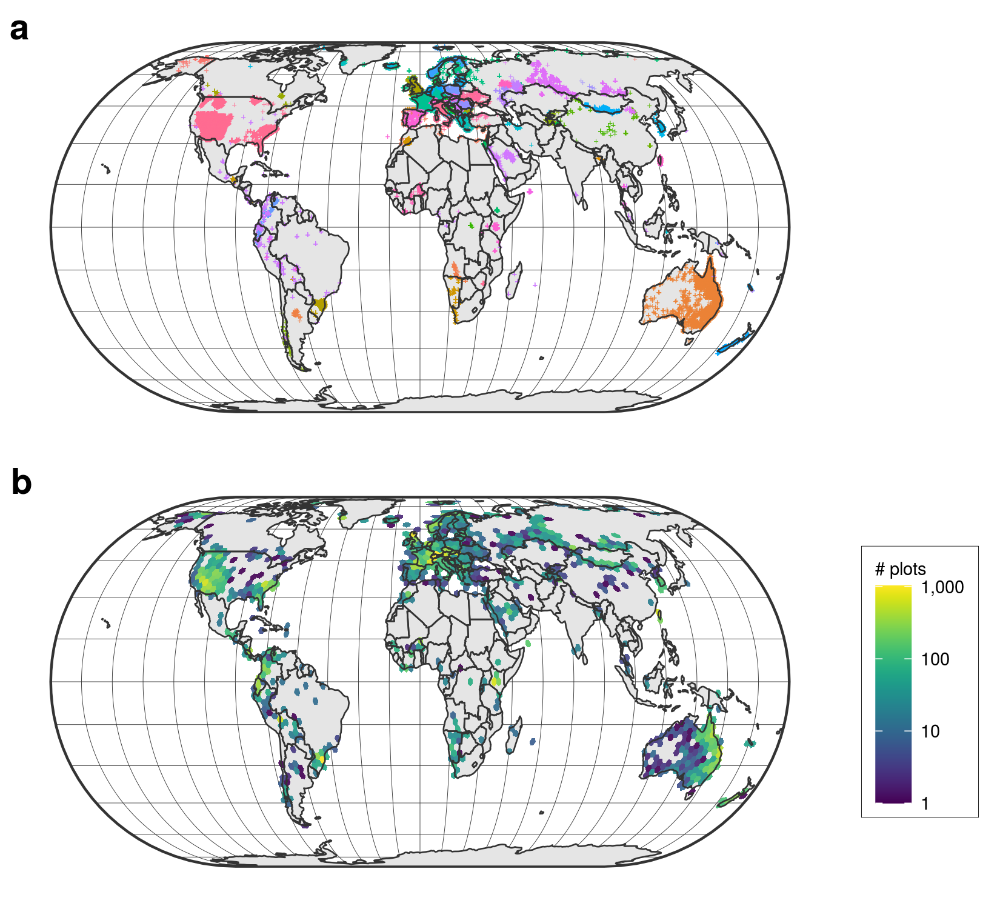

## Background & Summary {.page_break_before}

Biodiversity is facing a global crisis. 
As many as 1 million species are estimated to be already facing extinction, the far majority due to anthropogenic impacts, land-use and climate change (@ipbes2019). 
In addition, the rates of biodiversity redistribution and homogenization are accelerating (@doi:10.1038/s41586-020-2640-y, @doi:10.1038/s41559-020-1198-2; @doi:10.1038/s41559-020-1176-8). 
Biological assemblages are becoming progressively more similar to each other globally, as local biodiversity and endemic species go extinct and are replaced by more widespread and competitive native or alien species (@ipbes2019; @doi:10.1038/s41559-020-1176-8). 
This has profound potential impacts on human and ecosystem health (@doi:10.1126/science.aai9214;  @doi:10.1111/brv.12344). 
For instance, many terrestrial and marine species are shifting their geographical distribution as a response to climate change (@doi:10.1038/s41559-020-1198-2), including animals hosting pathogens transmissible to humans (@doi:10.1038/nature06536; @doi:10.1016/j.ttbdis.2010.10.006; @doi:10.1126/science.1244325).  

Plant communities are no exception to this biodiversity crisis (@doi:10.1126/science.1156831; @doi:10.3732/ajb.1000364; @doi:10.1038/s41559-020-1176-8). 
This is worrisome since terrestrial vegetation accounts for 80% (450 Gt C) of the living biomass on Earth (@doi:10.1073/pnas.1711842115). Given the central role of vegetation in ecosystem productivity, stability and functioning (@doi:10.3732/ajb.1000364), assessing biodiversity status and trends in plant communities is paramount for other life compartments and human societies alike.  

Monitoring trends in plant biodiversity requires adequate data across a range of spatiotemporal scales (@doi:10.1016/j.oneear.2020.09.010, @doi:10.1002/ppp3.10160). 
Large independent collections of plant occurrence data do exist at the global or continental extent via the Botanical Information and Ecology Network (BIEN) (@doi:10.7287/peerj.preprints.2615v2), the Global Inventory of Floras and Traits (GIFT) (@doi:10.1111/jbi.13623) or the Global Biodiversity Information Facility (GBIF) (https://www.gbif.org/). 
However, all these presence-only databases either neglect how individual plant species co-occur and interact locally to form plant communities, or are collected at spatial resolutions which are too coarse to assess biodiversity trends (e.g., one‐degree grid cells) at the scale of local plant assemblages (@doi:10.1371/journal.pbio.1000385).  

Yet, there is a long-lasting tradition among botanists to record the cover or abundance of each plant species that occurs in a vegetation plot of a given size (i.e. surface area) at a given time (e.g. @Stebler1893). 
Compared to presence-only data, vegetation plot data (presence-absence) present many advantages. 
First, they contain information on which plant species co‐occur together in the same locality at a given moment in time (@doi:10.1111/avsc.12191). 
This is a necessary prerequisite for testing hypotheses related to biotic interactions among plant species (i.e. interspecific plant interactions). 
Vegetation plot data also provide crucial information on where and when a species is absent, therefore improving current species distribution models (@doi:10.1890/07-2153.1). 
Being spatially explicit, vegetation plots can be resurveyed through time to assess potential changes in plant species composition relative to a baseline (@doi:10.1111/gcb.14030; @doi:10.1038/s41586-018-0005-6, @doi:10.1038/s41559-020-1176-8). 
As they normally contain information on the relative cover or abundance of each species, vegetation plots are also more adequate to detect biodiversity changes, compared to data representing the occurrence of individual species only (@doi:10.1111/j.1654-1103.2011.01318.x).  

Vegetation-plot data are very fragmented, though, as they typically stem from a myriad of local research projects (@doi:10.1111/jvs.12710). 
Consequently, these data often have either fine-grain spatial resolutions but small spatial extents, or vice versa (@doi:10.1371/journal.pbio.3000183). 
Furthermore, with their disparate sampling protocols, standards and taxonomic resolutions, aggregating and harmonizing vegetation plot data proves extremely challenging (@doi:10.1038/s41559-018-0699-8). 
It is not surprising, therefore, that these data are rarely used in global‐scale biodiversity research (@doi:10.1111/geb.12501; @doi:10.1111/jvs.12419; @doi:10.1111/jvs.12864).  

The sPlot initiative tries to close this data gap. 
It leverages numerous local-to-regional vegetation-plot datasets to create a harmonized and comprehensive global database of georeferenced terrestrial plant species assemblages (@doi:10.1111/jvs.12710). 
Established in 2013, sPlot currently contains more than 1.9 million vegetation plots, and is fully integrated with the TRY database (@https://doi.org/10.1111/gcb.14904), from which it derives information on plant functional traits. 
The sPlot database is increasingly being used to study continental-to-global scale vegetation patterns, such as the relative contribution of regional vs. local factors on the global patterns of fern richness (@doi:10.1111/jbi.13782), the mechanisms underlying the spread and abundance of native vs. invasive tree species (@doi:10.1111/geb.13027), and worldwide trait–environment relationships in plant communities (@doi:10.1038/s41559-018-0699-8).  

Here, we provide an open-access data set composed of 91,056 vegetation plots, representative of the environmental space covered by the sPlot database. 
The selected vegetation plots stem from 104 databases and span across 115 countries (Figure {@fig:Figure1}). 
This resampled dataset (sPlot Open - hereafter) is composed of: 
(1) plot-level information, including metadata and basic vegetation structure descriptors; 
(2) the vascular plant species composition of each vegetation plot, including species cover or abundance information when available; and 
(3) community-level functional information derived from the TRY database (@https://doi.org/10.1111/gcb.14904).  

{#fig:Figure1}
