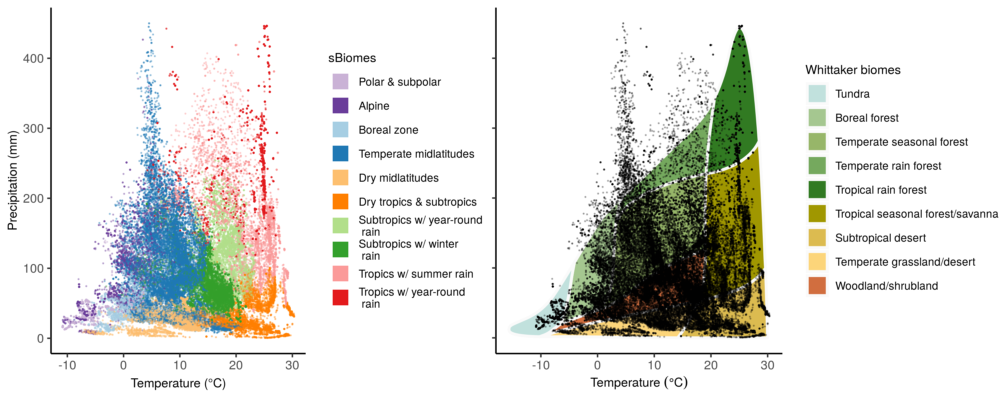

## Data Records {.page_break_before}

The final dataset provided as sPlot Open contains 91,031 vegetation plots from 115 countries and all continents except Antarctica (Figure {@fig:Figure1}). This randomized selection stems from 103 constitutive datasets (Table @tbl:Table1). It only contains the species composition of vascular plants, while information on the composition of bryophytes and lichens was discarded since it was only available for a minority of plots (n = 4,963 and n = 3,045, respectively).
Information on the size (surface area) of the vegetation survey is available for 61,898 vegetation plots, and ranges between 0.01 m^2^ and 4 ha (mean = 270 m^2^; median = 78.5 m^2^). 
The average number of vascular plant species per vegetation plot ranges between 1 (i.e. monospecific stands) and 270 species (mean = 17.6; median = 13). 

By reducing the overrepresentation of vegetation plots in specific environmental conditions, the resampling procedure described above strongly reduced the bias in the distribution of vegetation plots within the environmental niche space. 
Yet, due to the lack or scarcity of data from some geographical regions, like the tropics, the spatial distribution of vegetation plots remains unbalanced across geographical regions (Figure {@fig:Figure1}). This is evident when comparing the number of plots across continents or biomes. 
Europe is by far the best represented continent, with 53,884 vegetation plots. 
In contrast, Africa and South America have only 4,507 and 5,515 vegetation plots, respectively. 
The representation of biomes is equally unbalanced. 
The biomes ‘Temperate midlatitudes’ and ‘Subtropics with winter rain’ have 37,507 and 16,510 vegetation plots, respectively, while none of the other biomes have more than 10,000 vegetation plots (Figure {@fig:Figure2}). Yet all Whittaker biomes are covered by sPlot Open.

{#fig:Figure2}

Finally, the dataset contains a relatively balanced number of forest (n = 25,832) vs. non forest (n = 38,203) vegetation plots, with a minor proportion of plots remaining unassigned (n = 10,050). 
The assignment of plots to forests and non-forests is based on multiple lines of evidence, including the plot-level information on the cover of the tree layer, as well as traits of species composing a plot, such as growth form and height. 
In short, a plot record was considered a forest if the cover of the tree layer, or alternatively, the sum of the relative cover of all tree taxa (normalized to 100%), was greater than 25%. It was instead considered a non-forest record if the sum of relative cover of low‐stature, non‐tree and non‐shrub taxa was greater than 90%. 
For an extensive explanation of this classification scheme, we refer the reader to Bruelheide et al. (2019) \[@doi:10.1111/jvs.12710\]. 
Even if the proportion of forest vs. non-forest vegetation plots is relatively well-balanced, the geographical distribution of vegetation plots belonging to different vegetation types is likely not balanced in the geographical space, as it depends on the idiosyncrasies of the constitutive datasets composing the sPlot database. 
For instance, the data from New Zealand only include plots collected in non-forest ecosystems, while data from Chile only refer to forests. 
We invite potential users to carefully read the description of each individual dataset in [GIVD](http://www.givd.info), or to contact the custodians of each dataset before using sPlot Open.
