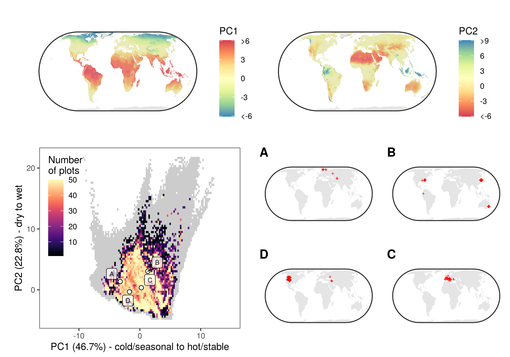

## Data Records {.page_break_before}

The final dataset that is provided here as open access contains 91,031 vegetation plots from 115 countries and all continents except Antarctica (Figure {@fig:Figure1}) and stems from 103 constitutive datasets (@tbl:Table1).
Information on the size (surface area) of the vegetation survey is available for 61,898 vegetation plots, and ranges between 0.01 m^2^ and 4 ha (mean = 270 m^2^; median = 78.5 m^2^). 
The average number of vascular plant species per vegetation plot ranges between 1 (i.e. monospecific stands) and 270 species (mean = 17.6; median = 13). 
Most plots only include information on vascular plants, while a minority also includes information on lichens (n = 3,045) or mosses (n = 4,963).
By reducing the overrepresentation of vegetation plots in specific environmental conditions, the resampling procedure described above strongly reduced the bias in the distribution of vegetation plots within the environmental niche space. 
Yet, due to the lack or scarcity of data from some geographical regions, like the tropics, the spatial distribution of vegetation plots remains unbalanced across geographical regions (Figure {@fig:Figure1}). This is evident when comparing the number of plots across continents or biomes. 
Europe is by far the best represented continent, with 53,884 vegetation plots. 
In contrast, Africa and South America have only 4507 and 5515 vegetation plots, respectively. 
The representation of biomes is equally unbalanced. 
The biomes ‘Temperate midlatitudes’ and ‘Subtropics with winter rain’ have 37,507 and 16,510 vegetation plots, respectively, while none of the other biomes have more than 10,000 vegetation plots (Figure {@fig:Figure2}).

{#fig:Figure2}

Finally, the dataset contains a relatively balanced number of forest (n = 25,832) vs. non forest (n = 38,203) vegetation plots, with a minor proportion of plots remaining unassigned (n = 10,050). 
The assignment of plots to forests and non-forests is based on multiple lines of evidence, including the plot-level information on the cover of the tree layer, as well as traits of species composing a plot, such as growth form and height. 
In short, a plot record was considered a forest if the cover of the tree layer, or alternatively, the sum of relative cover of all tree taxa, was greater than 0.25. It was instead considered a non-forest record if the sum of relative cover of low‐stature, non‐tree and non‐shrub taxa was greater than 0.90. 
For an extensive explanation on this classification scheme, we refer the reader to \[@doi:10.1111/jvs.12710\]. 
Even if the proportion of forest vs. non-forest vegetation plots is relatively well-balanced, the geographical distribution of vegetation plots belonging to different vegetation types is likely not balanced in the geographical space, as it depends on the idiosyncrasies of the individual datasets composing the sPlot database. 
For instance, the data from New Zealand only include plots collected in non-forest ecosystems, while data from Chile only refer to forests. 
We invite potential users to carefully read the description of each individual dataset before using this open-access dataset.
