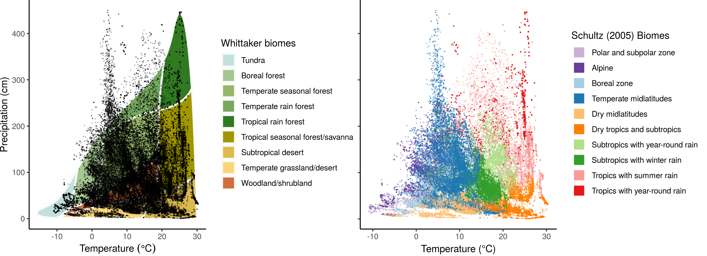

---
author-meta:
- Francesco Maria Sabatini
- Jonathan Lenoir
- Tarek Hattab
- Elise Arnst
- "Milan Chytr\xFD"
- "J\xFCrgen Dengler"
- "Val\xE9rio De Patta Pillar"
- Patrice De Ruffray
- Stephan M. Hennekens
- Ute Jandt
- Florian Jansen
- "Borja Jim\xE9nez-Alfaro"
- Jens Kattge
- Aurora Levesley
- Oliver Purschke
- Brody Sandel
- Fahmida Sultana
- Tsipe Aavik
- "Svetlana A\u0107i\u0107"
- Alicia Acosta
- Emiliano Agrillo
- Miguel Alvarez
- Iva Apostolova
- Mohammed A.S. Arfin Khan
- Fabio Attorre
- Isabelle Aubin
- Marijn Bauters
- Yves Bergeron
- Erwin Bergmeier
- Idoia Biurrun
- Anne D. Bjorkman
- Gianmaria Bonari
- Viktoria Bondareva
- "J\xF6rg Brunet"
- "Andra\u017E \u010Carni"
- Laura Casella
- Luis Cayuela
- "Tom\xE1\u0161 \u010Cern\xFD"
- Victor Chepinoga
- "J\xE1nos Csiky"
- "Renata \u0106u\u0161terevska"
- Els De Bie
- Michele De Sanctis
- Panayotis Dimopoulos
- Jiri Dolezal
- Tetiana Dziuba
- Mohamed Abd El-Rouf Mousa El-Sheikh
- Brian Enquist
- "J\xF6rg Ewald"
- Richard Field
- Manfred Finckh
- "Antonio Gal\xE1n-de-Mera"
- Emmanuel Garbolino
- "Andr\xE9 Luis de Gasper"
- Hamid Gholizadeh
- Melisa Giorgis
- Valentin Golub
- Inger Greve Alsos
- John-Arvid Grytnes
- Alvaro G. Gutierrez
- Sylvia Haider
- Mohamed Z. Hatim
- Bruno Herault
- Guillermo Hinojos Mendoza
- "Norbert H\xF6lzel"
- "J\xFCrgen Homeier"
- Wannes Hubau
- Adrian Indreica
- John Janssen
- Birgit Jedrzejek
- Anke Jentsch
- "Norbert J\xFCrgens"
- "Zygmunt K\u0105cki"
- Jutta Kapfer
- "Ali Kavgac\u0131"
- Elizabeth Kearsley
- Michael Kessler
- Larisa Khanina
- Andrey Korolyuk
- Holger Kreft
- "Hjalmar K\xFChl"
- Anna Kuzemko
- Flavia Landucci
- Hongyan Liu
- Tatiana Lysenko
- Miguel D. Mahecha
- "Corrado Marcen\xF2"
- Vasiliy Martynenko
- Jesper Erenskjold Moeslund
- Ladislav Mucina
- "Jonas V. M\xFCller"
- "J\xE9r\xF4me Munzinger"
- Alireza Naqinezhad
- Jalil Noroozi
- Arkadiusz Nowak
- Viktor Onyshchenko
- Gerhard E. Overbeck
- "An\xEDbal Pauchard"
- Robert K. Peet
- "Aaron P\xE9rez-Haase"
- "Tom\xE1\u0161 Peterka"
- Gwendolyn Peyre
- Oliver L. Phillips
- Vadim Prokhorov
- "Valerijus Ra\u0161omavi\u010Dius"
- Rasmus Revermann
- Gonzalo Rivas-Torres
- John S. Rodwell
- Eszter Ruprecht
- "Solvita R\u016Bsi\u0146a"
- Cyrus Samimi
- Marco Schmidt
- Franziska Schrodt
- Pavel Shirokikh
- "Jozef \u0160ib\xEDk"
- "Urban \u0160ilc"
- "Petr Sklen\xE1\u0159"
- "\u017Deljko \u0160kvorc"
- Anita Smyth
- Ben Sparrow
- Marta Gaia Sperandii
- "Zvjezdana Stan\u010Di\u0107"
- Jens-Christian Svenning
- Zhiyao Tang
- Cindy Q. Tang
- Ioannis Tsiripidis
- "Milan Valachovi\u010D"
- "Kim Andr\xE9 Vanselow"
- Kiril Vassilev
- "Eduardo V\xE9lez-Martin"
- Roberto Venanzoni
- Alexander Christian Vibrans
- Cyrille Violle
- Risto Virtanen
- Henrik von Wehrden
- Viktoria Wagner
- Donald A. Walker
- Desalegn Wana
- Hua-Feng Wang
- Karsten Wesche
- Timothy Whitfeld
- Wolfgang Willner
- Susan Wiser
- Thomas Wohlgemuth
- Sergey Yamalov
- Martin Zobel
- Helge Bruelheide
bibliography:
- content/manual-references.json
date-meta: '2020-11-18'
header-includes: "<!--\nManubot generated metadata rendered from header-includes-template.html.\nSuggest improvements at https://github.com/manubot/manubot/blob/master/manubot/process/header-includes-template.html\n-->\n<meta name=\"dc.format\" content=\"text/html\" />\n<meta name=\"dc.title\" content=\"sPlot open - An environmentally-balanced, open-access, global dataset of vegetation plots\" />\n<meta name=\"citation_title\" content=\"sPlot open - An environmentally-balanced, open-access, global dataset of vegetation plots\" />\n<meta property=\"og:title\" content=\"sPlot open - An environmentally-balanced, open-access, global dataset of vegetation plots\" />\n<meta property=\"twitter:title\" content=\"sPlot open - An environmentally-balanced, open-access, global dataset of vegetation plots\" />\n<meta name=\"dc.date\" content=\"2020-11-18\" />\n<meta name=\"citation_publication_date\" content=\"2020-11-18\" />\n<meta name=\"dc.language\" content=\"en-US\" />\n<meta name=\"citation_language\" content=\"en-US\" />\n<meta name=\"dc.relation.ispartof\" content=\"Manubot\" />\n<meta name=\"dc.publisher\" content=\"Manubot\" />\n<meta name=\"citation_journal_title\" content=\"Manubot\" />\n<meta name=\"citation_technical_report_institution\" content=\"Manubot\" />\n<meta name=\"citation_author\" content=\"Francesco Maria Sabatini\" />\n<meta name=\"citation_author_institution\" content=\"German Centre for Integrative Biodiversity Research (iDiv) Halle-Jena-Leipzig, Puschstrasse 4, 04103, Leipzig, Germany\" />\n<meta name=\"citation_author_institution\" content=\"Martin-Luther University Halle-Wittenberg, Institute of Biology, Am Kirchtor 1, 06108, Halle, Germany\" />\n<meta name=\"citation_author_orcid\" content=\"0000-0002-7202-7697\" />\n<meta name=\"twitter:creator\" content=\"@sPlot_iDiv\" />\n<meta name=\"citation_author\" content=\"Jonathan Lenoir\" />\n<meta name=\"citation_author_institution\" content=\"Universit\xE9 de Picardie Jules Verne, Unit\xE9 de Recherche \u201CEcologie et Dynamique des Syst\xE8mes Anthropis\xE9s\u201D (EDYSAN), UMR 7058 CNRS, 1 Rue des Louvels, 80000, Amiens, France\" />\n<meta name=\"citation_author_orcid\" content=\"0000-0003-0638-9582\" />\n<meta name=\"twitter:creator\" content=\"@EkoLogIt\" />\n<meta name=\"citation_author\" content=\"Tarek Hattab\" />\n<meta name=\"citation_author_institution\" content=\"MARBEC, University of Montpellier, CNRS, IFREMER and IRD, S\xE8te, France\" />\n<meta name=\"citation_author_orcid\" content=\"0000-0002-1420-5758\" />\n<meta name=\"citation_author\" content=\"Elise Arnst\" />\n<meta name=\"citation_author_institution\" content=\"Manaaki Whenua -- Landcare Research, PO Box 69040, 7640, Lincoln, New Zealand\" />\n<meta name=\"citation_author\" content=\"Milan Chytr\xFD\" />\n<meta name=\"citation_author_institution\" content=\"Masaryk University, Faculty of Science, Department of Botany and Zoology, Kotl\xE1\u0159sk\xE1 2, 611 37, Brno, Czech Republic\" />\n<meta name=\"citation_author_orcid\" content=\"0000-0002-8122-3075\" />\n<meta name=\"citation_author\" content=\"J\xFCrgen Dengler\" />\n<meta name=\"citation_author_institution\" content=\"Zurich University of Applied Sciences (ZHAW), Vegetation Ecology Group, Institute of Natural Resource Sciences (IUNR), Gr\xFCentalstr. 14, 8820, W\xE4denswil, Switzerland\" />\n<meta name=\"citation_author_institution\" content=\"University of Bayreuth, Plant Ecology, Bayreuth Center of Ecology and Environmental Research (BayCEER), Universit\xE4tsstr. 30, 95447, Bayreuth, Germany\" />\n<meta name=\"citation_author_institution\" content=\"German Centre for Integrative Biodiversity Research (iDiv) Halle-Jena-Leipzig, Puschstrasse 4, 04103, Leipzig, Germany\" />\n<meta name=\"citation_author_orcid\" content=\"0000-0003-3221-660X\" />\n<meta name=\"citation_author\" content=\"Val\xE9rio De Patta Pillar\" />\n<meta name=\"citation_author_institution\" content=\"Federal University of Rio Grande do Sul, Ecology, Av. Bento Gon\xE7alves 9500, 91501-970, Porto Alegre, Brazil\" />\n<meta name=\"citation_author\" content=\"Patrice De Ruffray\" />\n<meta name=\"citation_author_institution\" content=\"Universit\xE9 de Strasbourg, Institut de biologie mol\xE9culaire des plantes-CNRS, 12, rue du G\xE9n\xE9ral-Zimmer, F-67084, Strasburg, France\" />\n<meta name=\"citation_author\" content=\"Stephan M. Hennekens\" />\n<meta name=\"citation_author_institution\" content=\"Wageningen University and Research, Wageningen Environmental Research (Alterra), P.O.Box 47, 6700 AA, Wageningen, Netherlands\" />\n<meta name=\"citation_author\" content=\"Ute Jandt\" />\n<meta name=\"citation_author_institution\" content=\"Martin-Luther University Halle-Wittenberg, Institute of Biology, Am Kirchtor 1, 06108, Halle, Germany\" />\n<meta name=\"citation_author\" content=\"Florian Jansen\" />\n<meta name=\"citation_author_institution\" content=\"University of Rostock, Faculty of Agricultural and Environmental Sciences, Justus-von-Liebig-Weg 6, 18059, Rostock, Germany\" />\n<meta name=\"citation_author\" content=\"Borja Jim\xE9nez-Alfaro\" />\n<meta name=\"citation_author_institution\" content=\"University of Oviedo, Research Unit of Biodiversity (CSIC/UO/PA), C. Gonzalo Guti\xE9rrez Quir\xF3s s/n, 33600, Mieres, Spain\" />\n<meta name=\"citation_author_orcid\" content=\"0000-0001-6601-9597\" />\n<meta name=\"citation_author\" content=\"Jens Kattge\" />\n<meta name=\"citation_author_institution\" content=\"Max Planck Institute for Biogeochemistry, Hans Kn\xF6ll Str. 10, 07745, Jena, Germany\" />\n<meta name=\"citation_author_orcid\" content=\"0000-0002-1022-8469\" />\n<meta name=\"citation_author\" content=\"Aurora Levesley\" />\n<meta name=\"citation_author_institution\" content=\"University of Leeds, School of Geography, Woodhouse Lane, LS2 9JT, Leeds, United Kingdom\" />\n<meta name=\"citation_author\" content=\"Oliver Purschke\" />\n<meta name=\"citation_author_institution\" content=\"Medical School of the Martin-Luther University Halle-Wittenberg, Institute for Medical Epidemiology, Biometrics and Informatics (IMEBI), Interdisciplinary Center for Health Sciences, Magdeburger Stra\xDFe 8, 06112, Halle/Saale, Germany\" />\n<meta name=\"citation_author_orcid\" content=\"0000-0003-0444-0882\" />\n<meta name=\"citation_author\" content=\"Brody Sandel\" />\n<meta name=\"citation_author_institution\" content=\"Aarhus University, Aarhus, Denmark\" />\n<meta name=\"citation_author\" content=\"Fahmida Sultana\" />\n<meta name=\"citation_author_institution\" content=\"Shahjalal University of Science &amp; Technology, Forestry &amp; Environmental Science, 3114, Sylhet, Bangladesh\" />\n<meta name=\"citation_author\" content=\"Tsipe Aavik\" />\n<meta name=\"citation_author_institution\" content=\"University of Tartu, Department of Ecology and Earth Sciences, Department of Botany, Lai 40, Tartu 51005, Estonia\" />\n<meta name=\"citation_author\" content=\"Svetlana A\u0107i\u0107\" />\n<meta name=\"citation_author_institution\" content=\"Faculty of Agriculture, Department of Agrobotany, Nemanjina 6, 11080, Belgrade-Zemun, Serbia\" />\n<meta name=\"citation_author\" content=\"Alicia Acosta\" />\n<meta name=\"citation_author_institution\" content=\"Roma Tre University, Department of Sciences, V.le Marconi 446, 00146, Rome, Italy\" />\n<meta name=\"citation_author\" content=\"Emiliano Agrillo\" />\n<meta name=\"citation_author_institution\" content=\"Sapienza University of Rome, Department of Environmental Biology, P.le Aldo Moro 5, 00185, Rome, Italy\" />\n<meta name=\"citation_author_orcid\" content=\"0000-0003-2346-8346\" />\n<meta name=\"citation_author\" content=\"Miguel Alvarez\" />\n<meta name=\"citation_author_institution\" content=\"University of Bonn, Plant Nutrition, INRES, Karlrobert-Kreiten-Str., 53115, Bonn, Germany\" />\n<meta name=\"citation_author_orcid\" content=\"0000-0003-1500-1834\" />\n<meta name=\"citation_author\" content=\"Iva Apostolova\" />\n<meta name=\"citation_author_institution\" content=\"Institute of Biodiversity and Ecosystem Research, Bulgarian Academy of Sciences, Department of Plant and Fungal Diversity and Resources, Acad. Georgi Bonchev 23, 1113, Sofia, Bulgaria\" />\n<meta name=\"citation_author\" content=\"Mohammed A.S. Arfin Khan\" />\n<meta name=\"citation_author_institution\" content=\"Shahjalal University of Science &amp; Technology, Forestry &amp; Environmental Science, Akhalia, 3114, Sylhet, Bangladesh\" />\n<meta name=\"citation_author_orcid\" content=\"0000-0001-6275-7023\" />\n<meta name=\"citation_author\" content=\"Fabio Attorre\" />\n<meta name=\"citation_author_institution\" content=\"Sapienza University of Rome, Department of Environmental Biology, P.le Aldo Moro 5, 00185, Rome, Italy\" />\n<meta name=\"citation_author_orcid\" content=\"0000-0002-7744-2195\" />\n<meta name=\"citation_author\" content=\"Isabelle Aubin\" />\n<meta name=\"citation_author_institution\" content=\"Canadian Forest Service, Natural Resources Canada, Great Lakes Forestry Centre, 1219 Queen St. East, P6A 2E5, Sault Ste Marie (Ontario), Canada\" />\n<meta name=\"citation_author\" content=\"Marijn Bauters\" />\n<meta name=\"citation_author_institution\" content=\"Ghent University, Department Green chemistry and technology, Isotope Bioscience laboratory (UGent-ISOFYS), Coupure Links 653, 9000, Ghent, Belgium\" />\n<meta name=\"citation_author_institution\" content=\"Ghent University, Department Environment, Computational and Applied Vegetation Ecology (UGent-CAVELab), Coupure Links 653, 9000, Ghent, Belgium\" />\n<meta name=\"citation_author\" content=\"Yves Bergeron\" />\n<meta name=\"citation_author_institution\" content=\"Universit\xE9 du Qu\xE9bec en Abitibi-T\xE9miscamingue, Forest Research Institute, 445 boul. de l&#39;Universit\xE9, J9X5E4, Rouyn-Noranda, Canada\" />\n<meta name=\"citation_author_orcid\" content=\"0000-0003-3707-3687\" />\n<meta name=\"citation_author\" content=\"Erwin Bergmeier\" />\n<meta name=\"citation_author_institution\" content=\"University of G\xF6ttingen, Vegetation Ecology and Phytodiversity, Untere Karsp\xFCle 2, 37073, G\xF6ttingen, Germany\" />\n<meta name=\"citation_author_orcid\" content=\"0000-0002-6118-4611\" />\n<meta name=\"citation_author\" content=\"Idoia Biurrun\" />\n<meta name=\"citation_author_institution\" content=\"University of the Basque Country UPV/EHU, Plant Biology and Ecology, P.O. Box 644, 48080, Bilbao, Spain\" />\n<meta name=\"citation_author_orcid\" content=\"0000-0002-1454-0433\" />\n<meta name=\"citation_author\" content=\"Anne D. Bjorkman\" />\n<meta name=\"citation_author_institution\" content=\"Aarhus University, Section for Ecoinformatics &amp; Biodiversity, Department of Bioscience, Ny Munkegade 114, 8000, Aarhus C, Denmark\" />\n<meta name=\"citation_author\" content=\"Gianmaria Bonari\" />\n<meta name=\"citation_author_institution\" content=\"Free University of Bozen-Bolzano, Piazza Universit\xE0, 5, 39100, Bolzano, Italy\" />\n<meta name=\"citation_author_orcid\" content=\"0000-0002-5574-6067\" />\n<meta name=\"citation_author\" content=\"Viktoria Bondareva\" />\n<meta name=\"citation_author_institution\" content=\"Institute of Ecology of the Volga River Basin, Department of Phytodiversity Problems, Komzina, 10, 445003, Toljatty, Russia\" />\n<meta name=\"citation_author\" content=\"J\xF6rg Brunet\" />\n<meta name=\"citation_author_institution\" content=\"Southern Swedish Forest Research Centre, Swedish University of Agricultural Sciences, Sundsv\xE4gen 3, 230 53 Alnarp, Sweden\" />\n<meta name=\"citation_author\" content=\"Andra\u017E \u010Carni\" />\n<meta name=\"citation_author_institution\" content=\"Research Center of the Slovenian Academy of Sciences and Arts, Institute of Biology, Novi trg 2, 1000, Ljubljana, Slovenia\" />\n<meta name=\"citation_author_institution\" content=\"University of Nova Gorica, School for viticulture and enology, Vipavska 13, 5000, Nova Gorica, Slovenia\" />\n<meta name=\"citation_author_orcid\" content=\"0000-0002-8909-4298\" />\n<meta name=\"citation_author\" content=\"Laura Casella\" />\n<meta name=\"citation_author_institution\" content=\"ISPRA - Italian National Institute for Environmental Protection and Research, Biodiversity Conservation Department, Via Vitaliano Brancati, 60, 00144, Roma, Italy\" />\n<meta name=\"citation_author_orcid\" content=\"0000-0003-2550-3010\" />\n<meta name=\"citation_author\" content=\"Luis Cayuela\" />\n<meta name=\"citation_author_institution\" content=\"Universidad Rey Juan Carlos, Department of Biology and Geology, Physics and Inorganic Chemistry, c/ Tulip\xE1n s/n, 28933, M\xF3stoles, Spain\" />\n<meta name=\"citation_author_orcid\" content=\"0000-0003-3562-2662\" />\n<meta name=\"citation_author\" content=\"Tom\xE1\u0161 \u010Cern\xFD\" />\n<meta name=\"citation_author_institution\" content=\"Czech University of Life Sciences Prague, Department of Forest Ecology, Faculty of Forestry and Wood Sciences, Kam\xFDck\xE1 1176, 165 21, Praha 6 - Suchdol, Czech Republic\" />\n<meta name=\"citation_author\" content=\"Victor Chepinoga\" />\n<meta name=\"citation_author_institution\" content=\"V.B. Sochava Insitute of Geography SB RAS, Laboratory of Physical Geography and Biogeography, Ulan-Batorskaya, 1, 664033, Irkutsk, Russian Federation\" />\n<meta name=\"citation_author_orcid\" content=\"0000-0003-3809-7453\" />\n<meta name=\"citation_author\" content=\"J\xE1nos Csiky\" />\n<meta name=\"citation_author_institution\" content=\"University of P\xE9cs, Department of Ecology, Ifj\xFAs\xE1g u. 6., 7624, P\xE9cs, Hungary\" />\n<meta name=\"citation_author\" content=\"Renata \u0106u\u0161terevska\" />\n<meta name=\"citation_author_institution\" content=\"Faculty of Natural Sciences and Mathematics, Institute of Biology, Arhimedova 3, 1000, Skopje, Republic of Macedonia\" />\n<meta name=\"citation_author\" content=\"Els De Bie\" />\n<meta name=\"citation_author_institution\" content=\"Research Institute for Nature and Forest\_(INBO), Departement of Biodiversity and Natural Environment, Havenlaan 88, bus 73, 1000, Brussels, Belgium\" />\n<meta name=\"citation_author\" content=\"Michele De Sanctis\" />\n<meta name=\"citation_author_institution\" content=\"Sapienza University of Rome, Department of Environmental Biology, P.le Aldo Moro 5, 00185, Rome, Italy\" />\n<meta name=\"citation_author_orcid\" content=\"0000-0002-7280-6199\" />\n<meta name=\"citation_author\" content=\"Panayotis Dimopoulos\" />\n<meta name=\"citation_author_institution\" content=\"University of Patras, Institute of Botany, Division of Plant Biology, Department of Biology, University Campus, 26504, Patras, Greece\" />\n<meta name=\"citation_author\" content=\"Jiri Dolezal\" />\n<meta name=\"citation_author_institution\" content=\"Institute of Botany, Czech Academy of Sciences, Department of Functional Ecology, Dukelska 135, 37901, Trebon, Czech Republic\" />\n<meta name=\"citation_author_orcid\" content=\"0000-0002-5829-4051\" />\n<meta name=\"citation_author\" content=\"Tetiana Dziuba\" />\n<meta name=\"citation_author_institution\" content=\"M.G. Kholodny Institute of Botany, National Academy of Sciences of Ukraine, Geobotany and ecology, Tereschenkivska, 1004, Kyiv, Ukraine\" />\n<meta name=\"citation_author\" content=\"Mohamed Abd El-Rouf Mousa El-Sheikh\" />\n<meta name=\"citation_author_institution\" content=\"College of Science, King Saud University, Botany and Microbiology Department, P.O. Box 2455, 11451, Riyadh, Saudi Arabia\" />\n<meta name=\"citation_author_institution\" content=\"Damanhour University, Botany Department, Faculty of Science, Damanhour, Egypt\" />\n<meta name=\"citation_author\" content=\"Brian Enquist\" />\n<meta name=\"citation_author_institution\" content=\"University of Arizona, Ecology and Evolutionary Biology, 1041 E. Lowell St., AZ 85721, Tucson, United States\" />\n<meta name=\"citation_author\" content=\"J\xF6rg Ewald\" />\n<meta name=\"citation_author_institution\" content=\"Hochschule Weihenstephan-Triesdorf, University of Applied Sciences, Hans-Carl-von-Carlowitz-Platz 3, 85354, Freising, Germany\" />\n<meta name=\"citation_author\" content=\"Richard Field\" />\n<meta name=\"citation_author_institution\" content=\"University of Nottingham, School of Geography, University Park, NG7 2RD, Nottingham, United Kingdom\" />\n<meta name=\"citation_author_orcid\" content=\"0000-0003-2613-2688\" />\n<meta name=\"citation_author\" content=\"Manfred Finckh\" />\n<meta name=\"citation_author_institution\" content=\"University of Hamburg, Biodiversity, Ecology and Evolution of Plants, Institute for Plant Science &amp; Microbiology, Ohnhorststr. 18, 22609, Hamburg, Germany\" />\n<meta name=\"citation_author\" content=\"Antonio Gal\xE1n-de-Mera\" />\n<meta name=\"citation_author_institution\" content=\"Universidad CEU San Pablo, Laboratorio de Bot\xE1nica, P.O. Box 67, 28660, Boadilla del Monte, Madrid, Spain\" />\n<meta name=\"citation_author_institution\" content=\"Universidad Privada Antonio Guillermo Urrelo, Laboratorio de Bot\xE1nica, Jr. Jos\xE9 Sabogal\" />\n<meta name=\"citation_author_institution\" content=\"Estudios Fitogeogr\xE1ficos del Per\xFA, Herbario AQP, S\xE1nchez Cerro 219, Manuel Prado, Paucarpata, Arequipa, Peru\" />\n<meta name=\"citation_author_orcid\" content=\"0000-0002-1652-5931\" />\n<meta name=\"citation_author\" content=\"Emmanuel Garbolino\" />\n<meta name=\"citation_author_institution\" content=\"Climpact Data Science (CDS), Nova Sophia - Regus Nova, 291 rue Albert Caquot, CS 40095, 06902, Sophia Antipolis Cedex, France\" />\n<meta name=\"citation_author\" content=\"Andr\xE9 Luis de Gasper\" />\n<meta name=\"citation_author_institution\" content=\"Regional University of Blumenau, Departament of Natural Science, Antonio da Veiga, 140, \u200B89030-903, Blumenau, Brazil\" />\n<meta name=\"citation_author_orcid\" content=\"0000-0002-1940-9581\" />\n<meta name=\"citation_author\" content=\"Hamid Gholizadeh\" />\n<meta name=\"citation_author_institution\" content=\"University of Mazandaran, Department of Biology, Babolsar, Iran\" />\n<meta name=\"citation_author\" content=\"Melisa Giorgis\" />\n<meta name=\"citation_author_institution\" content=\"Instituto Multidisciplinario de Biolog\xEDa Vegetal (IMBIV-CONICET), ECOLOG\xCDA VEGETAL Y FITOGEOGRAF\xCDA, Av. V\xE9lez S\xE1rsfield 1611, 5000, C\xF3rdoba, Argentina\" />\n<meta name=\"citation_author_orcid\" content=\"0000-0001-6126-6660\" />\n<meta name=\"citation_author\" content=\"Valentin Golub\" />\n<meta name=\"citation_author_institution\" content=\"Institute of Ecology of the Volga River Basin, Laboratory of Phytocoenology, Komzina, 10, 445003, Toljatty, Russia\" />\n<meta name=\"citation_author\" content=\"Inger Greve Alsos\" />\n<meta name=\"citation_author_institution\" content=\"The Arctic University Museum of Norway, UiT - The Arctic University of Norway, Troms\xF8, Norway\" />\n<meta name=\"citation_author\" content=\"John-Arvid Grytnes\" />\n<meta name=\"citation_author_institution\" content=\"University of Bergen, Department of Biological Sciences, Postbox 7803\" />\n<meta name=\"citation_author\" content=\"Alvaro G. Gutierrez\" />\n<meta name=\"citation_author_institution\" content=\"Universidad de Chile, Departamento de Ciencias Ambientales y Recursos Naturales Renovables, Facultad de Ciencias Agronomicas, Santa Rosa 11315, La Pintana, 8820808, Santiago, Chile\" />\n<meta name=\"citation_author_orcid\" content=\"0000-0001-8928-3198\" />\n<meta name=\"citation_author\" content=\"Sylvia Haider\" />\n<meta name=\"citation_author_institution\" content=\"Martin-Luther University Halle-Wittenberg, Institute of Biology, Am Kirchtor 1, 06108, Halle, Germany\" />\n<meta name=\"citation_author\" content=\"Mohamed Z. Hatim\" />\n<meta name=\"citation_author_institution\" content=\"Wageningen University, Plant Ecology and Nature Conservation Group - Environmental Sciences Department, P.O. Box Postbus 47, Droevendaalsesteeg 3, 6700 AA, Wageningen, The Netherlands\" />\n<meta name=\"citation_author_institution\" content=\"Tanta University, Botany and Microbiology Department - Faculty of Science, El Geish St., 31527, Tanta, Egypt\" />\n<meta name=\"citation_author_orcid\" content=\"0000-0002-0872-5108\" />\n<meta name=\"citation_author\" content=\"Bruno Herault\" />\n<meta name=\"citation_author_institution\" content=\"University of Montpellier, CIRAD, Forets et Soci\xE9t\xE9s, Montpellier, France\" />\n<meta name=\"citation_author_orcid\" content=\"0000-0002-6950-7286\" />\n<meta name=\"citation_author\" content=\"Guillermo Hinojos Mendoza\" />\n<meta name=\"citation_author_institution\" content=\"ASES Ecological and Sustainable Services, P\xE9pini\xE8re d\u2019Entreprises l\u2019Esp\xE9lidou, Parc d\u2019Activit\xE9s du Vinobre, 555 Chemin des Traverses, Lachapelle-sous-Aubenas, 07200, Aubenas, France\" />\n<meta name=\"citation_author\" content=\"Norbert H\xF6lzel\" />\n<meta name=\"citation_author_institution\" content=\"University of Muenster, Institute of Landscape Ecology, Heisenbergstr. 2, 48149, M\xFCnster, Germany\" />\n<meta name=\"citation_author_orcid\" content=\"0000-0002-6367-3400\" />\n<meta name=\"citation_author\" content=\"J\xFCrgen Homeier\" />\n<meta name=\"citation_author_institution\" content=\"University of G\xF6ttingen, Plant Ecology and Ecosystems Research, Untere Karsp\xFCle 2, 37073, G\xF6ttingen, Germany\" />\n<meta name=\"citation_author\" content=\"Wannes Hubau\" />\n<meta name=\"citation_author_institution\" content=\"Ghent University, Department Environment, Laboratory of Wood Biology (UGent-WoodLab), Coupure Links 653, 9000, Ghent, Belgium\" />\n<meta name=\"citation_author_institution\" content=\"Royal Museum for Central Africa, Service of Wood Biology, Leuvensesteenweg 13, 3080, Tervuren, Belgium\" />\n<meta name=\"citation_author\" content=\"Adrian Indreica\" />\n<meta name=\"citation_author_institution\" content=\"Transilvania University of Brasov, Department of Silviculture, Sirul Beethoven 1, 500123, Brasov, Romania\" />\n<meta name=\"citation_author\" content=\"John Janssen\" />\n<meta name=\"citation_author_institution\" content=\"Wageningen University and Research, Wageningen Environmental Research (Alterra), P.O.Box 47, 6700 AA, Wageningen, Netherlands\" />\n<meta name=\"citation_author\" content=\"Birgit Jedrzejek\" />\n<meta name=\"citation_author_institution\" content=\"University of M\xFCnster, Institute of Landscape Ecology, Heisenbergstr. 2, 48149, M\xFCnster, Germany\" />\n<meta name=\"citation_author\" content=\"Anke Jentsch\" />\n<meta name=\"citation_author_institution\" content=\"University of Bayreuth, Department of Disturbance Ecology, Universit\xE4tsstr. 30, 95447, Bayreuth, Germany\" />\n<meta name=\"citation_author\" content=\"Norbert J\xFCrgens\" />\n<meta name=\"citation_author_institution\" content=\"University of Hamburg, Biodiversity, Ecology and Evolution of Plants, Institute for Plant Science &amp; Microbiology, Ohnhorststr. 18, 22609, Hamburg, Germany\" />\n<meta name=\"citation_author_orcid\" content=\"0000-0003-3211-0549\" />\n<meta name=\"citation_author\" content=\"Zygmunt K\u0105cki\" />\n<meta name=\"citation_author_institution\" content=\"University of Wroc\u0142aw, Botanical Garden, Sienkiewicza 23, 50-335, Wroc\u0142aw, Poland\" />\n<meta name=\"citation_author\" content=\"Jutta Kapfer\" />\n<meta name=\"citation_author_institution\" content=\"Norwegian Institute of Bioeconomy Research, Holtvegen, 66, Troms\xF8, 9016, Norway\" />\n<meta name=\"citation_author\" content=\"Ali Kavgac\u0131\" />\n<meta name=\"citation_author_institution\" content=\"Soutwest Anatolia Forest Research Institute, Silviculture and Forest Botany, POB 264, 07002, Antalya, Turkey\" />\n<meta name=\"citation_author_orcid\" content=\"0000-0002-4549-3668\" />\n<meta name=\"citation_author\" content=\"Elizabeth Kearsley\" />\n<meta name=\"citation_author_institution\" content=\"Ghent University, Department Environment, Computational and Applied Vegetation Ecology (UGent-CAVELab), Coupure Links 653, 9000, Gent, Belgium\" />\n<meta name=\"citation_author_orcid\" content=\"0000-0003-0046-3606\" />\n<meta name=\"citation_author\" content=\"Michael Kessler\" />\n<meta name=\"citation_author_institution\" content=\"University of Zurich, Department of Systematic and Evolutionary Botany, Zollikerstrasse 107, 8008, Zurich, Switzerland\" />\n<meta name=\"citation_author_orcid\" content=\"0000-0003-4612-9937\" />\n<meta name=\"citation_author\" content=\"Larisa Khanina\" />\n<meta name=\"citation_author_institution\" content=\"Institute of Mathematical Problems of Biology of Russian Academy of Sciences, Laboratory of Computational Ecology, Prof. Vitkevicha str., 142290, Pushchino, Russia\" />\n<meta name=\"citation_author_orcid\" content=\"0000-0002-8937-5938\" />\n<meta name=\"citation_author\" content=\"Andrey Korolyuk\" />\n<meta name=\"citation_author_institution\" content=\"Central Siberian Botanical Garden, Siberian Branch, Russian Academy of Sciences, Geosystem Laboratory, Zolotodolinskaya str. 101, 630090, Novosibirsk, Russian Federation\" />\n<meta name=\"citation_author\" content=\"Holger Kreft\" />\n<meta name=\"citation_author_institution\" content=\"University of G\xF6ttingen, Department of Biodiversity, Macroecology and Biogeography, B\xFCsgenweg 1, 37077, G\xF6ttingen, Germany\" />\n<meta name=\"citation_author_orcid\" content=\"0000-0003-4471-8236\" />\n<meta name=\"citation_author\" content=\"Hjalmar K\xFChl\" />\n<meta name=\"citation_author_institution\" content=\"Max Planck Institute for Evolutionary Anthropology (MPI-EVA), Primatology, Puschstrasse 4, 04103, Leipzig, Germany\" />\n<meta name=\"citation_author_institution\" content=\"German Centre for Integrative Biodiversity Research (iDiv) Halle-Jena-Leipzig, Puschstrasse 4, 04103, Leipzig, Germany\" />\n<meta name=\"citation_author\" content=\"Anna Kuzemko\" />\n<meta name=\"citation_author_institution\" content=\"M.G. Kholodny Institute of Botany NAS of Ukraine, Geobotany and Ecology, Tereshchenkivska 2, 01601, Kyiv, Ukraine\" />\n<meta name=\"citation_author\" content=\"Flavia Landucci\" />\n<meta name=\"citation_author_institution\" content=\"Masaryk University, Department of Botany and Zoology, Kotl\xE1\u0159sk\xE1 2, 611 37, Brno, Czech Republic\" />\n<meta name=\"citation_author_orcid\" content=\"0000-0002-6848-0384\" />\n<meta name=\"citation_author\" content=\"Hongyan Liu\" />\n<meta name=\"citation_author_institution\" content=\"Peking University, College of Urban and Environmental Sciences, Yiheyuan Rd. 5, 100871, Beijing, China\" />\n<meta name=\"citation_author\" content=\"Tatiana Lysenko\" />\n<meta name=\"citation_author_institution\" content=\"Institute of Ecology of the Volga River Basin RAS, Dept. of the Phytodiversity Problems, Komzin str. 10, 445003, Togliatti, Russia\" />\n<meta name=\"citation_author\" content=\"Miguel D. Mahecha\" />\n<meta name=\"citation_author_institution\" content=\"Leipzig University, Remote Sensing Centre for Earth System Research, Talstr. 6b, 07745, Leipzig, Germany\" />\n<meta name=\"citation_author\" content=\"Corrado Marcen\xF2\" />\n<meta name=\"citation_author_institution\" content=\"University of the Basque Country UPV/EHU, Plant Biology and Ecology, P.O. Box 644, 48080, Bilbao, Spain\" />\n<meta name=\"citation_author_orcid\" content=\"0000-0003-4361-5200\" />\n<meta name=\"citation_author\" content=\"Vasiliy Martynenko\" />\n<meta name=\"citation_author_institution\" content=\"Ufa Institute of Biology of the Russian Academy of Sciences, October av. 69, 450054, Ufa, Russia\" />\n<meta name=\"citation_author\" content=\"Jesper Erenskjold Moeslund\" />\n<meta name=\"citation_author_institution\" content=\"Aarhus University, Department of Bioscience, Grenaavej 14, 8410, Roende, Denmark\" />\n<meta name=\"citation_author_orcid\" content=\"0000-0001-8591-7149\" />\n<meta name=\"citation_author\" content=\"Ladislav Mucina\" />\n<meta name=\"citation_author_institution\" content=\"Murdoch University, Harry Butler Institute, 90 South Street,  Building 390, 6150, Murdoch, Australia\" />\n<meta name=\"citation_author_orcid\" content=\"0000-0003-0317-8886\" />\n<meta name=\"citation_author\" content=\"Jonas V. M\xFCller\" />\n<meta name=\"citation_author_institution\" content=\"Royal Botanic Gardens, Kew, Conservation Science, Wakehurst Place, RH17 6TN, Ardingly, West Sussex, United Kingdom\" />\n<meta name=\"citation_author\" content=\"J\xE9r\xF4me Munzinger\" />\n<meta name=\"citation_author_institution\" content=\"IRD, CIRAD, CNRS, INRA, Universit\xE9 Montpellier, AMAP - Botany and Modelling of Plant Architecture and Vegetation, Boulevard de la Lironde, 34398, Montpellier, France\" />\n<meta name=\"citation_author_orcid\" content=\"0000-0001-5300-2702\" />\n<meta name=\"citation_author\" content=\"Alireza Naqinezhad\" />\n<meta name=\"citation_author_institution\" content=\"University of Mazandaran, Department of Biology, P.O. Box 47416-95447, Mazandaran, Iran\" />\n<meta name=\"citation_author\" content=\"Jalil Noroozi\" />\n<meta name=\"citation_author_institution\" content=\"University of Vienna, Department of Botany and Biodiversity Research, Rennweg 14, 1030, Vienna, Austria\" />\n<meta name=\"citation_author\" content=\"Arkadiusz Nowak\" />\n<meta name=\"citation_author_institution\" content=\"Polish Academy of Sciences, Botanical Garden - Center for Biological Diversity Conservation, Prawdziwka 2, 02-976, Warszawa, Poland\" />\n<meta name=\"citation_author_orcid\" content=\"0000-0001-8638-0208\" />\n<meta name=\"citation_author\" content=\"Viktor Onyshchenko\" />\n<meta name=\"citation_author_institution\" content=\"National Academy of Sciences of Ukraine, M.G. Kholodny Institute of Botany, Tereshchenkivska 2, 01601, Kyiv, Ukraine\" />\n<meta name=\"citation_author\" content=\"Gerhard E. Overbeck\" />\n<meta name=\"citation_author_institution\" content=\"Universidade Federal do Rio Grande do Sul, Department of Botany, Av. Bento Gon\xE7alves 9500, 91501-970, Porto Alegre, Brazil\" />\n<meta name=\"citation_author_orcid\" content=\"0000-0002-8716-5136\" />\n<meta name=\"citation_author\" content=\"An\xEDbal Pauchard\" />\n<meta name=\"citation_author_institution\" content=\"Universidad de Concepci\xF3n, Laboratorio de Invasiones Biol\xF3gicas (LIB). Facultad de Ciencias Forestales., Victoria 631, 4030000.0, Concepci\xF3n, Chile\" />\n<meta name=\"citation_author_institution\" content=\"Institute of Ecology and Biodiversity (IEB), Chile\" />\n<meta name=\"citation_author_orcid\" content=\"0000-0003-1284-3163\" />\n<meta name=\"citation_author\" content=\"Robert K. Peet\" />\n<meta name=\"citation_author_institution\" content=\"University of North Carolina, Department of Biology, CB3280, South Road, 27599-3280, Chapel Hill, NC, United States\" />\n<meta name=\"citation_author\" content=\"Aaron P\xE9rez-Haase\" />\n<meta name=\"citation_author_institution\" content=\"University of Vic-Central University of Catalonia, Department of Biosciences, Carrer de la Laura, 13, 08500, Vic, Barcelona, Spain\" />\n<meta name=\"citation_author_institution\" content=\"University of Barcelona, Department of Evolutionary Biology, Ecology and Environmental Sciences, Diagonal 643, 08028, Barcelona, Spain\" />\n<meta name=\"citation_author_orcid\" content=\"0000-0002-5974-7374\" />\n<meta name=\"citation_author\" content=\"Tom\xE1\u0161 Peterka\" />\n<meta name=\"citation_author_institution\" content=\"Masaryk University, Department of Botany and Zoology, Kotl\xE1\u0159sk\xE1 2, 611 37, Brno, Czech Republic\" />\n<meta name=\"citation_author\" content=\"Gwendolyn Peyre\" />\n<meta name=\"citation_author_institution\" content=\"University of the Andes, Department of Civil and Environmental Engineering, Carrera 1 Este No. 19A-40, Edificio Mario Laserna, Piso 6\_, 111711, Bogota, Colombia\" />\n<meta name=\"citation_author_orcid\" content=\"0000-0002-1977-7181\" />\n<meta name=\"citation_author\" content=\"Oliver L. Phillips\" />\n<meta name=\"citation_author_institution\" content=\"University of Leeds, School of Geography, Woodhouse Lane, LS2 9JT, Leeds, United Kingdom\" />\n<meta name=\"citation_author_orcid\" content=\"0000-0002-8993-6168\" />\n<meta name=\"citation_author\" content=\"Vadim Prokhorov\" />\n<meta name=\"citation_author_institution\" content=\"Kazan Federal University, Institute of Environmental Sciences, Kremlevskaya 18, 420008, Kazan, Russia\" />\n<meta name=\"citation_author\" content=\"Valerijus Ra\u0161omavi\u010Dius\" />\n<meta name=\"citation_author_institution\" content=\"Nature Research Centre, Institute of Botany, Zaliuju Ezeru 49, 08406, Vilnius, Lithuania\" />\n<meta name=\"citation_author\" content=\"Rasmus Revermann\" />\n<meta name=\"citation_author_institution\" content=\"University of Hamburg, Biodiversity, Ecology and Evolution of Plants, Institute for Plant Science &amp; Microbiology, Ohnhorststr. 18, 22609, Hamburg, Germany\" />\n<meta name=\"citation_author\" content=\"Gonzalo Rivas-Torres\" />\n<meta name=\"citation_author_institution\" content=\"Universidad San Francisco de Quito, COCIBA, Diego de Robles, 170177, Quito, Ecuador\" />\n<meta name=\"citation_author_orcid\" content=\"0000-0002-2704-8288\" />\n<meta name=\"citation_author\" content=\"John S. Rodwell\" />\n<meta name=\"citation_author_institution\" content=\"NA, 7 Derwent Road, LA1 3ES, Lancaster, United Kingdom\" />\n<meta name=\"citation_author\" content=\"Eszter Ruprecht\" />\n<meta name=\"citation_author_institution\" content=\"Babe\u0219-Bolyai University, Hungarian Department of Biology and Ecology, Faculty of Biology and Geology, Republicii street 42., 400015, Cluj-Napoca, Romania\" />\n<meta name=\"citation_author\" content=\"Solvita R\u016Bsi\u0146a\" />\n<meta name=\"citation_author_institution\" content=\"University of Latvia, Department of Geography, 1 Jelgavas Street, 1004, Riga, Latvia\" />\n<meta name=\"citation_author\" content=\"Cyrus Samimi\" />\n<meta name=\"citation_author_institution\" content=\"University of Bayreuth, Climatology, Bayreuth Center of Ecology and Environmental Research (BayCEER), Universit\xE4tsstr. 30, 95447, Bayreuth, Germany\" />\n<meta name=\"citation_author\" content=\"Marco Schmidt\" />\n<meta name=\"citation_author_institution\" content=\"Stadt Frankfurt am Main - Der Magistrat, Palmengarten, Siesmayerstra\xDFe 61, 60323, Frankfurt am Main, Germany\" />\n<meta name=\"citation_author_orcid\" content=\"0000-0001-6087-6117\" />\n<meta name=\"citation_author\" content=\"Franziska Schrodt\" />\n<meta name=\"citation_author_institution\" content=\"University of Nottingham, School of Geography, University Park, NG7 2RD, Nottingham, UK\" />\n<meta name=\"citation_author_orcid\" content=\"0000-0001-9053-8872\" />\n<meta name=\"citation_author\" content=\"Pavel Shirokikh\" />\n<meta name=\"citation_author_institution\" content=\"Ufa Institute of biology \u2013 Subdivision of the Ufa Federal Research Centre of Russian Academy of Science, prospekt Oktyabrya, 450054, Ufa, Russia\" />\n<meta name=\"citation_author\" content=\"Jozef \u0160ib\xEDk\" />\n<meta name=\"citation_author_institution\" content=\"Plant Science and Biodiversity Centre Slovak Academy of Sciences, Institute of Botany, Dubravska cesta 9, 84523, Bratislava, Slovakia\" />\n<meta name=\"citation_author_orcid\" content=\"0000-0002-5949-862X\" />\n<meta name=\"citation_author\" content=\"Urban \u0160ilc\" />\n<meta name=\"citation_author_institution\" content=\"Research Centre of Slovenian Academy of Sciences and Arts (ZRC SAZU), Institute of Biology, Novi trg 2, 1000, Ljubljana, Slovenia\" />\n<meta name=\"citation_author_orcid\" content=\"0000-0002-3052-699X\" />\n<meta name=\"citation_author\" content=\"Petr Sklen\xE1\u0159\" />\n<meta name=\"citation_author_institution\" content=\"Department of Botany, Charles University, Benatska 2, 12801 Prague, Czech Repunlic\" />\n<meta name=\"citation_author\" content=\"\u017Deljko \u0160kvorc\" />\n<meta name=\"citation_author_institution\" content=\"University of Zagreb, Faculty of Forestry, Sveto\u0161imunska 25, 10000, Zagreb, Croatia\" />\n<meta name=\"citation_author\" content=\"Anita Smyth\" />\n<meta name=\"citation_author_institution\" content=\"University of Adelaide, TERN, North Terrace, 5005, Adelaide, Australia\" />\n<meta name=\"citation_author\" content=\"Ben Sparrow\" />\n<meta name=\"citation_author_institution\" content=\"University of Adelaide, TERN, North Terrace, 5005, Adelaide, Australia\" />\n<meta name=\"citation_author\" content=\"Marta Gaia Sperandii\" />\n<meta name=\"citation_author_institution\" content=\"Universit\xE0 degli Studi Roma TRE, Dipartimento di Scienze, viale G.Marconi 446, 00146, Rome, Italy\" />\n<meta name=\"citation_author_institution\" content=\"Centro de Investigaciones sobre Desertificaci\xF3n (CSIC\u2010UV\u2010GV), Carretera Moncada\u2012N\xE1quera km 4.5, 46113.0, Moncada (Valencia), Spain\" />\n<meta name=\"citation_author_orcid\" content=\"0000-0002-2507-5928\" />\n<meta name=\"citation_author\" content=\"Zvjezdana Stan\u010Di\u0107\" />\n<meta name=\"citation_author_institution\" content=\"University of Zagreb, Faculty of Geotechnical Engineering, Hallerova aleja 7, 42000, Vara\u017Edin, Croatia\" />\n<meta name=\"citation_author\" content=\"Jens-Christian Svenning\" />\n<meta name=\"citation_author_institution\" content=\"Aarhus University, Department of Biology, Ny Munkegade 114, DK-8000, Aarhus C, Denmark\" />\n<meta name=\"citation_author_orcid\" content=\"0000-0002-3415-0862\" />\n<meta name=\"citation_author\" content=\"Zhiyao Tang\" />\n<meta name=\"citation_author_institution\" content=\"Peking University, College of Urban and Environmental Sciences, Yiheyuan Rd. 5, 100871, Beijing, China\" />\n<meta name=\"citation_author\" content=\"Cindy Q. Tang\" />\n<meta name=\"citation_author_institution\" content=\"Yunnan University, School of Ecology and Environmental Science, Building Shixun, Chenggong Campus, Dongwaihuan South Road, University Town, Chenggong New District, 650504, Kunming, China\" />\n<meta name=\"citation_author\" content=\"Ioannis Tsiripidis\" />\n<meta name=\"citation_author_institution\" content=\"Aristotle University of Thessaloniki, School of Biology, 54124, Thessaloniki, Greece\" />\n<meta name=\"citation_author\" content=\"Milan Valachovi\u010D\" />\n<meta name=\"citation_author_institution\" content=\"Plant Science and Biodiversity Centre Slovak Academy of Sciences, Institute of Botany, Dubravska cesta 9, 84523, Bratislava, Slovakia\" />\n<meta name=\"citation_author\" content=\"Kim Andr\xE9 Vanselow\" />\n<meta name=\"citation_author_institution\" content=\"University of Erlangen-Nuremberg, Department of Geography, Wetterkreuz 15, 91058, Erlangen, Germany\" />\n<meta name=\"citation_author\" content=\"Kiril Vassilev\" />\n<meta name=\"citation_author_institution\" content=\"Institute of Biodiversity and Ecosystem Research, Bulgarian Academy of Sciences, Department of Plant and Fungal Diversity and Resources, Acad. Georgi Bonchev 23, 1113, Sofia, Bulgaria\" />\n<meta name=\"citation_author\" content=\"Eduardo V\xE9lez-Martin\" />\n<meta name=\"citation_author_institution\" content=\"Universidade Federal do Rio Grande do Sul, Department of Ecology, Av Bento Gon\xE7alves 9500, 91501-970, Porto Alegre, Brazil\" />\n<meta name=\"citation_author_orcid\" content=\"0000-0001-8028-8953\" />\n<meta name=\"citation_author\" content=\"Roberto Venanzoni\" />\n<meta name=\"citation_author_institution\" content=\"University of Perugia, Department of Chemistry, Biology and Biotechnology, Borgo XX giugno 74, 06124, Perugia, Italy\" />\n<meta name=\"citation_author_orcid\" content=\"0000-0002-7768-0468\" />\n<meta name=\"citation_author\" content=\"Alexander Christian Vibrans\" />\n<meta name=\"citation_author_institution\" content=\"Universidade Regional de Blumenau, Departamento de Engenharia Florestal, Rua S\xE3o Paulo, 3250, 89030-000, Blumenau, Brazil\" />\n<meta name=\"citation_author\" content=\"Cyrille Violle\" />\n<meta name=\"citation_author_institution\" content=\"CNRS, UMR 5175 CEFE, 1919 route de Mende, 34293, Montpellier, France\" />\n<meta name=\"citation_author\" content=\"Risto Virtanen\" />\n<meta name=\"citation_author_institution\" content=\"University of Oulu, Ecology and Genetics Research Unit, Biodiversity Unit, Kaitov\xE4yl\xE4 5, 90014, Oulu, Finland\" />\n<meta name=\"citation_author_institution\" content=\"Helmholtz Center for Environmental Research - UFZ, Department of Physiological Diversity, Permoserstr. 15, 04318, Leipzig, Germany\" />\n<meta name=\"citation_author_institution\" content=\"German Centre for Integrative Biodiversity Research (iDiv) Halle-Jena-Leipzig, Puschstrasse 4, 04103, Leipzig, Germany\" />\n<meta name=\"citation_author_orcid\" content=\"0000-0002-8295-8217\" />\n<meta name=\"citation_author\" content=\"Henrik von Wehrden\" />\n<meta name=\"citation_author_institution\" content=\"Leuphana University of L\xFCneburg, Institute of Ecology, Universit\xE4tsallee 1, 21335, L\xFCneburg, Germany\" />\n<meta name=\"citation_author\" content=\"Viktoria Wagner\" />\n<meta name=\"citation_author_institution\" content=\"University of Alberta, Department of Biological Sciences, Biological Sciences Building, T6G2E9, Edmonton, Canada\" />\n<meta name=\"citation_author\" content=\"Donald A. Walker\" />\n<meta name=\"citation_author_institution\" content=\"University of Alaska, Institute of Arctic Biology, P. O. Box 7570000, 99775, Fairbanks, United States\" />\n<meta name=\"citation_author\" content=\"Desalegn Wana\" />\n<meta name=\"citation_author_institution\" content=\"Addis Ababa University, Department of Geography &amp; Environmental Studies, Sidist Kilo SQ, 150178, Addis Ababa, Ethiopia\" />\n<meta name=\"citation_author\" content=\"Hua-Feng Wang\" />\n<meta name=\"citation_author_institution\" content=\"Hainan University, Hainan Key Laboratory for Sustainable Utilization of Tropical Bioresources, College of Tropical Crops, 58 Renmin Avenue, Meilan District, 570228, Haikou, China\" />\n<meta name=\"citation_author\" content=\"Karsten Wesche\" />\n<meta name=\"citation_author_institution\" content=\"Senckenberg Museum of Natural History G\xF6rlitz, Botany Department, PO Box 300 154, 02806, G\xF6rlitz, Germany\" />\n<meta name=\"citation_author_institution\" content=\"German Centre for Integrative Biodiversity Research (iDiv) Halle-Jena-Leipzig, Puschstrasse 4, 04103, Leipzig, Germany\" />\n<meta name=\"citation_author_institution\" content=\"Technische Universit\xE4t Dresden, International Institute Zittau, Markt 23, 02763, Zittau, Germany\" />\n<meta name=\"citation_author\" content=\"Timothy Whitfeld\" />\n<meta name=\"citation_author_institution\" content=\"Brown University, Department of Ecology and Evolutionary Biology/Brown University Herbarium, 34 Olive Street, 02912, Providence, United States\" />\n<meta name=\"citation_author\" content=\"Wolfgang Willner\" />\n<meta name=\"citation_author_institution\" content=\"Vienna Institute for Nature Conservation &amp; Analyses, Giessergasse 6/7, 1090, Vienna, Austria\" />\n<meta name=\"citation_author\" content=\"Susan Wiser\" />\n<meta name=\"citation_author_institution\" content=\"Manaaki Whenua -- Landcare Research, PO Box 69040, 7640, Lincoln, New Zealand\" />\n<meta name=\"citation_author_orcid\" content=\"0000-0002-8938-8181\" />\n<meta name=\"citation_author\" content=\"Thomas Wohlgemuth\" />\n<meta name=\"citation_author_institution\" content=\"Swiss Federal Institute for Forest, Snow and Landscape Research WSL, Research Unit Forest Dynamics, Z\xFCrcherstrasse 111, 8903, Birmensdorf, Switzerland\" />\n<meta name=\"citation_author\" content=\"Sergey Yamalov\" />\n<meta name=\"citation_author_institution\" content=\"Ufa Scientific Centre, Russian Academy of Sciences, Laboratory of Wild-Growing Flora, Botanical Garden-Institute, Mendeleev str., 195/3, 450080, Ufa, Russia\" />\n<meta name=\"citation_author\" content=\"Martin Zobel\" />\n<meta name=\"citation_author_institution\" content=\"University of Tartu, Institute of ecology and earth sciences, Lai st 40, Tartu 51005, Estonia\" />\n<meta name=\"citation_author\" content=\"Helge Bruelheide\" />\n<meta name=\"citation_author_institution\" content=\"Martin-Luther University Halle-Wittenberg, Institute of Biology, Am Kirchtor 1, 06108, Halle, Germany\" />\n<meta name=\"citation_author_institution\" content=\"German Centre for Integrative Biodiversity Research (iDiv) Halle-Jena-Leipzig, Puschstrasse 4, 04103, Leipzig, Germany\" />\n<meta name=\"citation_author_orcid\" content=\"0000-0003-3135-0356\" />\n<meta name=\"twitter:creator\" content=\"@HelgeBruelheide\" />\n<link rel=\"canonical\" href=\"https://fmsabatini.github.io/sPlotOpen_Manuscript/\" />\n<meta property=\"og:url\" content=\"https://fmsabatini.github.io/sPlotOpen_Manuscript/\" />\n<meta property=\"twitter:url\" content=\"https://fmsabatini.github.io/sPlotOpen_Manuscript/\" />\n<meta name=\"citation_fulltext_html_url\" content=\"https://fmsabatini.github.io/sPlotOpen_Manuscript/\" />\n<meta name=\"citation_pdf_url\" content=\"https://fmsabatini.github.io/sPlotOpen_Manuscript/manuscript.pdf\" />\n<link rel=\"alternate\" type=\"application/pdf\" href=\"https://fmsabatini.github.io/sPlotOpen_Manuscript/manuscript.pdf\" />\n<link rel=\"alternate\" type=\"text/html\" href=\"https://fmsabatini.github.io/sPlotOpen_Manuscript/v/d15274e40ce8ddd13c0704d8674c565a51aba2fe/\" />\n<meta name=\"manubot_html_url_versioned\" content=\"https://fmsabatini.github.io/sPlotOpen_Manuscript/v/d15274e40ce8ddd13c0704d8674c565a51aba2fe/\" />\n<meta name=\"manubot_pdf_url_versioned\" content=\"https://fmsabatini.github.io/sPlotOpen_Manuscript/v/d15274e40ce8ddd13c0704d8674c565a51aba2fe/manuscript.pdf\" />\n<meta property=\"og:type\" content=\"article\" />\n<meta property=\"twitter:card\" content=\"summary_large_image\" />\n<link rel=\"icon\" type=\"image/png\" sizes=\"192x192\" href=\"https://manubot.org/favicon-192x192.png\" />\n<link rel=\"mask-icon\" href=\"https://manubot.org/safari-pinned-tab.svg\" color=\"#ad1457\" />\n<meta name=\"theme-color\" content=\"#ad1457\" />\n<!-- end Manubot generated metadata -->"
keywords:
- vegetation
- database
- plants
- biodiversity
- functional traits
- big-data
- manubot
lang: en-US
manubot-clear-requests-cache: false
manubot-output-bibliography: output/references.json
manubot-output-citekeys: output/citations.tsv
manubot-requests-cache-path: ci/cache/requests-cache
title: sPlot open - An environmentally-balanced, open-access, global dataset of vegetation plots
...

_This manuscript is still work in progress_

<small><em>
This manuscript
([permalink](https://fmsabatini.github.io/sPlotOpen_Manuscript/v/d15274e40ce8ddd13c0704d8674c565a51aba2fe/))
was automatically generated
from [fmsabatini/sPlotOpen_Manuscript@d15274e](https://github.com/fmsabatini/sPlotOpen_Manuscript/tree/d15274e40ce8ddd13c0704d8674c565a51aba2fe)
on November 18, 2020.
</em></small>

## Authors

  [{height="11px" width="11px"}](https://orcid.org/0000-0002-7202-7697)Francesco Maria Sabatini1,2,†,
  [{height="11px" width="11px"}](https://orcid.org/0000-0003-0638-9582)Jonathan Lenoir3,†,
  [{height="11px" width="11px"}](https://orcid.org/0000-0002-1420-5758)Tarek Hattab4,
  Elise Arnst5,
  [{height="11px" width="11px"}](https://orcid.org/0000-0002-8122-3075)Milan Chytrý6,
  [{height="11px" width="11px"}](https://orcid.org/0000-0003-3221-660X)Jürgen Dengler1,7,8,
  Valério De Patta Pillar9,
  Patrice De Ruffray10,
  Stephan M. Hennekens11,
  Ute Jandt2,
  Florian Jansen12,
  [{height="11px" width="11px"}](https://orcid.org/0000-0001-6601-9597)Borja Jiménez-Alfaro13,
  [{height="11px" width="11px"}](https://orcid.org/0000-0002-1022-8469)Jens Kattge14,
  Aurora Levesley15,
  [{height="11px" width="11px"}](https://orcid.org/0000-0003-0444-0882)Oliver Purschke16,
  Brody Sandel17,
  Fahmida Sultana18,
  Tsipe Aavik19,
  Svetlana Aćić20,
  Alicia Acosta21,
  [{height="11px" width="11px"}](https://orcid.org/0000-0003-2346-8346)Emiliano Agrillo22,
  [{height="11px" width="11px"}](https://orcid.org/0000-0003-1500-1834)Miguel Alvarez23,
  Iva Apostolova24,
  [{height="11px" width="11px"}](https://orcid.org/0000-0001-6275-7023)Mohammed A.S. Arfin Khan25,
  [{height="11px" width="11px"}](https://orcid.org/0000-0002-7744-2195)Fabio Attorre22,
  Isabelle Aubin26,
  Marijn Bauters27,28,
  [{height="11px" width="11px"}](https://orcid.org/0000-0003-3707-3687)Yves Bergeron29,
  [{height="11px" width="11px"}](https://orcid.org/0000-0002-6118-4611)Erwin Bergmeier30,
  [{height="11px" width="11px"}](https://orcid.org/0000-0002-1454-0433)Idoia Biurrun31,
  Anne D. Bjorkman32,
  [{height="11px" width="11px"}](https://orcid.org/0000-0002-5574-6067)Gianmaria Bonari33,
  Viktoria Bondareva34,
  Jörg Brunet35,
  [{height="11px" width="11px"}](https://orcid.org/0000-0002-8909-4298)Andraž Čarni36,37,
  [{height="11px" width="11px"}](https://orcid.org/0000-0003-2550-3010)Laura Casella38,
  [{height="11px" width="11px"}](https://orcid.org/0000-0003-3562-2662)Luis Cayuela39,
  Tomáš Černý40,
  [{height="11px" width="11px"}](https://orcid.org/0000-0003-3809-7453)Victor Chepinoga41,
  János Csiky42,
  Renata Ćušterevska43,
  Els De Bie44,
  [{height="11px" width="11px"}](https://orcid.org/0000-0002-7280-6199)Michele De Sanctis22,
  Panayotis Dimopoulos45,
  [{height="11px" width="11px"}](https://orcid.org/0000-0002-5829-4051)Jiri Dolezal46,
  Tetiana Dziuba47,
  Mohamed Abd El-Rouf Mousa El-Sheikh48,49,
  Brian Enquist50,
  Jörg Ewald51,
  [{height="11px" width="11px"}](https://orcid.org/0000-0003-2613-2688)Richard Field52,
  Manfred Finckh53,
  [{height="11px" width="11px"}](https://orcid.org/0000-0002-1652-5931)Antonio Galán-de-Mera54,55,56,
  Emmanuel Garbolino57,
  [{height="11px" width="11px"}](https://orcid.org/0000-0002-1940-9581)André Luis de Gasper58,
  Hamid Gholizadeh59,
  [{height="11px" width="11px"}](https://orcid.org/0000-0001-6126-6660)Melisa Giorgis60,
  Valentin Golub61,
  Inger Greve Alsos62,
  John-Arvid Grytnes63,
  [{height="11px" width="11px"}](https://orcid.org/0000-0001-8928-3198)Alvaro G. Gutierrez64,
  Sylvia Haider2,
  [{height="11px" width="11px"}](https://orcid.org/0000-0002-0872-5108)Mohamed Z. Hatim65,66,
  [{height="11px" width="11px"}](https://orcid.org/0000-0002-6950-7286)Bruno Herault67,
  Guillermo Hinojos Mendoza68,
  [{height="11px" width="11px"}](https://orcid.org/0000-0002-6367-3400)Norbert Hölzel69,
  Jürgen Homeier70,
  Wannes Hubau71,72,
  Adrian Indreica73,
  John Janssen11,
  Birgit Jedrzejek74,
  Anke Jentsch75,
  [{height="11px" width="11px"}](https://orcid.org/0000-0003-3211-0549)Norbert Jürgens53,
  Zygmunt Kącki76,
  Jutta Kapfer77,
  [{height="11px" width="11px"}](https://orcid.org/0000-0002-4549-3668)Ali Kavgacı78,
  [{height="11px" width="11px"}](https://orcid.org/0000-0003-0046-3606)Elizabeth Kearsley79,
  [{height="11px" width="11px"}](https://orcid.org/0000-0003-4612-9937)Michael Kessler80,
  [{height="11px" width="11px"}](https://orcid.org/0000-0002-8937-5938)Larisa Khanina81,
  Andrey Korolyuk82,
  [{height="11px" width="11px"}](https://orcid.org/0000-0003-4471-8236)Holger Kreft83,
  Hjalmar Kühl1,84,
  Anna Kuzemko85,
  [{height="11px" width="11px"}](https://orcid.org/0000-0002-6848-0384)Flavia Landucci86,
  Hongyan Liu87,
  Tatiana Lysenko88,
  Miguel D. Mahecha89,
  [{height="11px" width="11px"}](https://orcid.org/0000-0003-4361-5200)Corrado Marcenò31,
  Vasiliy Martynenko90,
  [{height="11px" width="11px"}](https://orcid.org/0000-0001-8591-7149)Jesper Erenskjold Moeslund91,
  [{height="11px" width="11px"}](https://orcid.org/0000-0003-0317-8886)Ladislav Mucina92,
  Jonas V. Müller93,
  [{height="11px" width="11px"}](https://orcid.org/0000-0001-5300-2702)Jérôme Munzinger94,
  Alireza Naqinezhad95,
  Jalil Noroozi96,
  [{height="11px" width="11px"}](https://orcid.org/0000-0001-8638-0208)Arkadiusz Nowak97,
  Viktor Onyshchenko98,
  [{height="11px" width="11px"}](https://orcid.org/0000-0002-8716-5136)Gerhard E. Overbeck99,
  [{height="11px" width="11px"}](https://orcid.org/0000-0003-1284-3163)Aníbal Pauchard100,101,
  Robert K. Peet102,
  [{height="11px" width="11px"}](https://orcid.org/0000-0002-5974-7374)Aaron Pérez-Haase103,104,
  Tomáš Peterka86,
  [{height="11px" width="11px"}](https://orcid.org/0000-0002-1977-7181)Gwendolyn Peyre105,
  [{height="11px" width="11px"}](https://orcid.org/0000-0002-8993-6168)Oliver L. Phillips15,
  Vadim Prokhorov106,
  Valerijus Rašomavičius107,
  Rasmus Revermann53,
  [{height="11px" width="11px"}](https://orcid.org/0000-0002-2704-8288)Gonzalo Rivas-Torres108,
  John S. Rodwell109,
  Eszter Ruprecht110,
  Solvita Rūsiņa111,
  Cyrus Samimi112,
  [{height="11px" width="11px"}](https://orcid.org/0000-0001-6087-6117)Marco Schmidt113,
  [{height="11px" width="11px"}](https://orcid.org/0000-0001-9053-8872)Franziska Schrodt114,
  Pavel Shirokikh115,
  [{height="11px" width="11px"}](https://orcid.org/0000-0002-5949-862X)Jozef Šibík116,
  [{height="11px" width="11px"}](https://orcid.org/0000-0002-3052-699X)Urban Šilc117,
  Petr Sklenář118,
  Željko Škvorc119,
  Anita Smyth120,
  Ben Sparrow120,
  [{height="11px" width="11px"}](https://orcid.org/0000-0002-2507-5928)Marta Gaia Sperandii121,122,
  Zvjezdana Stančić123,
  [{height="11px" width="11px"}](https://orcid.org/0000-0002-3415-0862)Jens-Christian Svenning124,
  Zhiyao Tang87,
  Cindy Q. Tang125,
  Ioannis Tsiripidis126,
  Milan Valachovič116,
  Kim André Vanselow127,
  Kiril Vassilev24,
  [{height="11px" width="11px"}](https://orcid.org/0000-0001-8028-8953)Eduardo Vélez-Martin128,
  [{height="11px" width="11px"}](https://orcid.org/0000-0002-7768-0468)Roberto Venanzoni129,
  Alexander Christian Vibrans130,
  Cyrille Violle131,
  [{height="11px" width="11px"}](https://orcid.org/0000-0002-8295-8217)Risto Virtanen1,132,133,
  Henrik von Wehrden134,
  Viktoria Wagner135,
  Donald A. Walker136,
  Desalegn Wana137,
  Hua-Feng Wang138,
  Karsten Wesche1,139,140,
  Timothy Whitfeld141,
  Wolfgang Willner142,
  [{height="11px" width="11px"}](https://orcid.org/0000-0002-8938-8181)Susan Wiser5,
  Thomas Wohlgemuth143,
  Sergey Yamalov144,
  Martin Zobel145,
  [{height="11px" width="11px"}](https://orcid.org/0000-0003-3135-0356)Helge Bruelheide1,2

✉ --- To whom correspondence should be addressed: francesco.sabatini@botanik.uni-halle.de 
† --- These authors contributed equally to this work

<small>

1. German Centre for Integrative Biodiversity Research (iDiv) Halle-Jena-Leipzig, Puschstrasse 4, 04103, Leipzig, Germany 
2. Martin-Luther University Halle-Wittenberg, Institute of Biology, Am Kirchtor 1, 06108, Halle, Germany 
3. Université de Picardie Jules Verne, Unité de Recherche “Ecologie et Dynamique des Systèmes Anthropisés” (EDYSAN), UMR 7058 CNRS, 1 Rue des Louvels, 80000, Amiens, France 
4. MARBEC, University of Montpellier, CNRS, IFREMER and IRD, Sète, France 
5. Manaaki Whenua -- Landcare Research, PO Box 69040, 7640, Lincoln, New Zealand 
6. Masaryk University, Faculty of Science, Department of Botany and Zoology, Kotlářská 2, 611 37, Brno, Czech Republic 
7. Zurich University of Applied Sciences (ZHAW), Vegetation Ecology Group, Institute of Natural Resource Sciences (IUNR), Grüentalstr. 14, 8820, Wädenswil, Switzerland 
8. University of Bayreuth, Plant Ecology, Bayreuth Center of Ecology and Environmental Research (BayCEER), Universitätsstr. 30, 95447, Bayreuth, Germany 
9. Federal University of Rio Grande do Sul, Ecology, Av. Bento Gonçalves 9500, 91501-970, Porto Alegre, Brazil 
10. Université de Strasbourg, Institut de biologie moléculaire des plantes-CNRS, 12, rue du Général-Zimmer, F-67084, Strasburg, France 
11. Wageningen University and Research, Wageningen Environmental Research (Alterra), P.O.Box 47, 6700 AA, Wageningen, Netherlands 
12. University of Rostock, Faculty of Agricultural and Environmental Sciences, Justus-von-Liebig-Weg 6, 18059, Rostock, Germany 
13. University of Oviedo, Research Unit of Biodiversity (CSIC/UO/PA), C. Gonzalo Gutiérrez Quirós s/n, 33600, Mieres, Spain 
14. Max Planck Institute for Biogeochemistry, Hans Knöll Str. 10, 07745, Jena, Germany 
15. University of Leeds, School of Geography, Woodhouse Lane, LS2 9JT, Leeds, United Kingdom 
16. Medical School of the Martin-Luther University Halle-Wittenberg, Institute for Medical Epidemiology, Biometrics and Informatics (IMEBI), Interdisciplinary Center for Health Sciences, Magdeburger Straße 8, 06112, Halle/Saale, Germany 
17. Aarhus University, Aarhus, Denmark 
18. Shahjalal University of Science & Technology, Forestry & Environmental Science, 3114, Sylhet, Bangladesh 
19. University of Tartu, Department of Ecology and Earth Sciences, Department of Botany, Lai 40, Tartu 51005, Estonia 
20. Faculty of Agriculture, Department of Agrobotany, Nemanjina 6, 11080, Belgrade-Zemun, Serbia 
21. Roma Tre University, Department of Sciences, V.le Marconi 446, 00146, Rome, Italy 
22. Sapienza University of Rome, Department of Environmental Biology, P.le Aldo Moro 5, 00185, Rome, Italy 
23. University of Bonn, Plant Nutrition, INRES, Karlrobert-Kreiten-Str., 53115, Bonn, Germany 
24. Institute of Biodiversity and Ecosystem Research, Bulgarian Academy of Sciences, Department of Plant and Fungal Diversity and Resources, Acad. Georgi Bonchev 23, 1113, Sofia, Bulgaria 
25. Shahjalal University of Science & Technology, Forestry & Environmental Science, Akhalia, 3114, Sylhet, Bangladesh 
26. Canadian Forest Service, Natural Resources Canada, Great Lakes Forestry Centre, 1219 Queen St. East, P6A 2E5, Sault Ste Marie (Ontario), Canada 
27. Ghent University, Department Green chemistry and technology, Isotope Bioscience laboratory (UGent-ISOFYS), Coupure Links 653, 9000, Ghent, Belgium 
28. Ghent University, Department Environment, Computational and Applied Vegetation Ecology (UGent-CAVELab), Coupure Links 653, 9000, Ghent, Belgium 
29. Université du Québec en Abitibi-Témiscamingue, Forest Research Institute, 445 boul. de l'Université, J9X5E4, Rouyn-Noranda, Canada 
30. University of Göttingen, Vegetation Ecology and Phytodiversity, Untere Karspüle 2, 37073, Göttingen, Germany 
31. University of the Basque Country UPV/EHU, Plant Biology and Ecology, P.O. Box 644, 48080, Bilbao, Spain 
32. Aarhus University, Section for Ecoinformatics & Biodiversity, Department of Bioscience, Ny Munkegade 114, 8000, Aarhus C, Denmark 
33. Free University of Bozen-Bolzano, Piazza Università, 5, 39100, Bolzano, Italy 
34. Institute of Ecology of the Volga River Basin, Department of Phytodiversity Problems, Komzina, 10, 445003, Toljatty, Russia 
35. Southern Swedish Forest Research Centre, Swedish University of Agricultural Sciences, Sundsvägen 3, 230 53 Alnarp, Sweden 
36. Research Center of the Slovenian Academy of Sciences and Arts, Institute of Biology, Novi trg 2, 1000, Ljubljana, Slovenia 
37. University of Nova Gorica, School for viticulture and enology, Vipavska 13, 5000, Nova Gorica, Slovenia 
38. ISPRA - Italian National Institute for Environmental Protection and Research, Biodiversity Conservation Department, Via Vitaliano Brancati, 60, 00144, Roma, Italy 
39. Universidad Rey Juan Carlos, Department of Biology and Geology, Physics and Inorganic Chemistry, c/ Tulipán s/n, 28933, Móstoles, Spain 
40. Czech University of Life Sciences Prague, Department of Forest Ecology, Faculty of Forestry and Wood Sciences, Kamýcká 1176, 165 21, Praha 6 - Suchdol, Czech Republic 
41. V.B. Sochava Insitute of Geography SB RAS, Laboratory of Physical Geography and Biogeography, Ulan-Batorskaya, 1, 664033, Irkutsk, Russian Federation 
42. University of Pécs, Department of Ecology, Ifjúság u. 6., 7624, Pécs, Hungary 
43. Faculty of Natural Sciences and Mathematics, Institute of Biology, Arhimedova 3, 1000, Skopje, Republic of Macedonia 
44. Research Institute for Nature and Forest (INBO), Departement of Biodiversity and Natural Environment, Havenlaan 88, bus 73, 1000, Brussels, Belgium 
45. University of Patras, Institute of Botany, Division of Plant Biology, Department of Biology, University Campus, 26504, Patras, Greece 
46. Institute of Botany, Czech Academy of Sciences, Department of Functional Ecology, Dukelska 135, 37901, Trebon, Czech Republic 
47. M.G. Kholodny Institute of Botany, National Academy of Sciences of Ukraine, Geobotany and ecology, Tereschenkivska, 1004, Kyiv, Ukraine 
48. College of Science, King Saud University, Botany and Microbiology Department, P.O. Box 2455, 11451, Riyadh, Saudi Arabia 
49. Damanhour University, Botany Department, Faculty of Science, Damanhour, Egypt 
50. University of Arizona, Ecology and Evolutionary Biology, 1041 E. Lowell St., AZ 85721, Tucson, United States 
51. Hochschule Weihenstephan-Triesdorf, University of Applied Sciences, Hans-Carl-von-Carlowitz-Platz 3, 85354, Freising, Germany 
52. University of Nottingham, School of Geography, University Park, NG7 2RD, Nottingham, United Kingdom 
53. University of Hamburg, Biodiversity, Ecology and Evolution of Plants, Institute for Plant Science & Microbiology, Ohnhorststr. 18, 22609, Hamburg, Germany 
54. Universidad CEU San Pablo, Laboratorio de Botánica, P.O. Box 67, 28660, Boadilla del Monte, Madrid, Spain 
55. Universidad Privada Antonio Guillermo Urrelo, Laboratorio de Botánica, Jr. José Sabogal 
56. Estudios Fitogeográficos del Perú, Herbario AQP, Sánchez Cerro 219, Manuel Prado, Paucarpata, Arequipa, Peru 
57. Climpact Data Science (CDS), Nova Sophia - Regus Nova, 291 rue Albert Caquot, CS 40095, 06902, Sophia Antipolis Cedex, France 
58. Regional University of Blumenau, Departament of Natural Science, Antonio da Veiga, 140, ​89030-903, Blumenau, Brazil 
59. University of Mazandaran, Department of Biology, Babolsar, Iran 
60. Instituto Multidisciplinario de Biología Vegetal (IMBIV-CONICET), ECOLOGÍA VEGETAL Y FITOGEOGRAFÍA, Av. Vélez Sársfield 1611, 5000, Córdoba, Argentina 
61. Institute of Ecology of the Volga River Basin, Laboratory of Phytocoenology, Komzina, 10, 445003, Toljatty, Russia 
62. The Arctic University Museum of Norway, UiT - The Arctic University of Norway, Tromsø, Norway 
63. University of Bergen, Department of Biological Sciences, Postbox 7803 
64. Universidad de Chile, Departamento de Ciencias Ambientales y Recursos Naturales Renovables, Facultad de Ciencias Agronomicas, Santa Rosa 11315, La Pintana, 8820808, Santiago, Chile 
65. Wageningen University, Plant Ecology and Nature Conservation Group - Environmental Sciences Department, P.O. Box Postbus 47, Droevendaalsesteeg 3, 6700 AA, Wageningen, The Netherlands 
66. Tanta University, Botany and Microbiology Department - Faculty of Science, El Geish St., 31527, Tanta, Egypt 
67. University of Montpellier, CIRAD, Forets et Sociétés, Montpellier, France 
68. ASES Ecological and Sustainable Services, Pépinière d’Entreprises l’Espélidou, Parc d’Activités du Vinobre, 555 Chemin des Traverses, Lachapelle-sous-Aubenas, 07200, Aubenas, France 
69. University of Muenster, Institute of Landscape Ecology, Heisenbergstr. 2, 48149, Münster, Germany 
70. University of Göttingen, Plant Ecology and Ecosystems Research, Untere Karspüle 2, 37073, Göttingen, Germany 
71. Ghent University, Department Environment, Laboratory of Wood Biology (UGent-WoodLab), Coupure Links 653, 9000, Ghent, Belgium 
72. Royal Museum for Central Africa, Service of Wood Biology, Leuvensesteenweg 13, 3080, Tervuren, Belgium 
73. Transilvania University of Brasov, Department of Silviculture, Sirul Beethoven 1, 500123, Brasov, Romania 
74. University of Münster, Institute of Landscape Ecology, Heisenbergstr. 2, 48149, Münster, Germany 
75. University of Bayreuth, Department of Disturbance Ecology, Universitätsstr. 30, 95447, Bayreuth, Germany 
76. University of Wrocław, Botanical Garden, Sienkiewicza 23, 50-335, Wrocław, Poland 
77. Norwegian Institute of Bioeconomy Research, Holtvegen, 66, Tromsø, 9016, Norway 
78. Soutwest Anatolia Forest Research Institute, Silviculture and Forest Botany, POB 264, 07002, Antalya, Turkey 
79. Ghent University, Department Environment, Computational and Applied Vegetation Ecology (UGent-CAVELab), Coupure Links 653, 9000, Gent, Belgium 
80. University of Zurich, Department of Systematic and Evolutionary Botany, Zollikerstrasse 107, 8008, Zurich, Switzerland 
81. Institute of Mathematical Problems of Biology of Russian Academy of Sciences, Laboratory of Computational Ecology, Prof. Vitkevicha str., 142290, Pushchino, Russia 
82. Central Siberian Botanical Garden, Siberian Branch, Russian Academy of Sciences, Geosystem Laboratory, Zolotodolinskaya str. 101, 630090, Novosibirsk, Russian Federation 
83. University of Göttingen, Department of Biodiversity, Macroecology and Biogeography, Büsgenweg 1, 37077, Göttingen, Germany 
84. Max Planck Institute for Evolutionary Anthropology (MPI-EVA), Primatology, Puschstrasse 4, 04103, Leipzig, Germany 
85. M.G. Kholodny Institute of Botany NAS of Ukraine, Geobotany and Ecology, Tereshchenkivska 2, 01601, Kyiv, Ukraine 
86. Masaryk University, Department of Botany and Zoology, Kotlářská 2, 611 37, Brno, Czech Republic 
87. Peking University, College of Urban and Environmental Sciences, Yiheyuan Rd. 5, 100871, Beijing, China 
88. Institute of Ecology of the Volga River Basin RAS, Dept. of the Phytodiversity Problems, Komzin str. 10, 445003, Togliatti, Russia 
89. Leipzig University, Remote Sensing Centre for Earth System Research, Talstr. 6b, 07745, Leipzig, Germany 
90. Ufa Institute of Biology of the Russian Academy of Sciences, October av. 69, 450054, Ufa, Russia 
91. Aarhus University, Department of Bioscience, Grenaavej 14, 8410, Roende, Denmark 
92. Murdoch University, Harry Butler Institute, 90 South Street,  Building 390, 6150, Murdoch, Australia 
93. Royal Botanic Gardens, Kew, Conservation Science, Wakehurst Place, RH17 6TN, Ardingly, West Sussex, United Kingdom 
94. IRD, CIRAD, CNRS, INRA, Université Montpellier, AMAP - Botany and Modelling of Plant Architecture and Vegetation, Boulevard de la Lironde, 34398, Montpellier, France 
95. University of Mazandaran, Department of Biology, P.O. Box 47416-95447, Mazandaran, Iran 
96. University of Vienna, Department of Botany and Biodiversity Research, Rennweg 14, 1030, Vienna, Austria 
97. Polish Academy of Sciences, Botanical Garden - Center for Biological Diversity Conservation, Prawdziwka 2, 02-976, Warszawa, Poland 
98. National Academy of Sciences of Ukraine, M.G. Kholodny Institute of Botany, Tereshchenkivska 2, 01601, Kyiv, Ukraine 
99. Universidade Federal do Rio Grande do Sul, Department of Botany, Av. Bento Gonçalves 9500, 91501-970, Porto Alegre, Brazil 
100. Universidad de Concepción, Laboratorio de Invasiones Biológicas (LIB). Facultad de Ciencias Forestales., Victoria 631, 4030000.0, Concepción, Chile 
101. Institute of Ecology and Biodiversity (IEB), Chile 
102. University of North Carolina, Department of Biology, CB3280, South Road, 27599-3280, Chapel Hill, NC, United States 
103. University of Vic-Central University of Catalonia, Department of Biosciences, Carrer de la Laura, 13, 08500, Vic, Barcelona, Spain 
104. University of Barcelona, Department of Evolutionary Biology, Ecology and Environmental Sciences, Diagonal 643, 08028, Barcelona, Spain 
105. University of the Andes, Department of Civil and Environmental Engineering, Carrera 1 Este No. 19A-40, Edificio Mario Laserna, Piso 6 , 111711, Bogota, Colombia 
106. Kazan Federal University, Institute of Environmental Sciences, Kremlevskaya 18, 420008, Kazan, Russia 
107. Nature Research Centre, Institute of Botany, Zaliuju Ezeru 49, 08406, Vilnius, Lithuania 
108. Universidad San Francisco de Quito, COCIBA, Diego de Robles, 170177, Quito, Ecuador 
109. NA, 7 Derwent Road, LA1 3ES, Lancaster, United Kingdom 
110. Babeș-Bolyai University, Hungarian Department of Biology and Ecology, Faculty of Biology and Geology, Republicii street 42., 400015, Cluj-Napoca, Romania 
111. University of Latvia, Department of Geography, 1 Jelgavas Street, 1004, Riga, Latvia 
112. University of Bayreuth, Climatology, Bayreuth Center of Ecology and Environmental Research (BayCEER), Universitätsstr. 30, 95447, Bayreuth, Germany 
113. Stadt Frankfurt am Main - Der Magistrat, Palmengarten, Siesmayerstraße 61, 60323, Frankfurt am Main, Germany 
114. University of Nottingham, School of Geography, University Park, NG7 2RD, Nottingham, UK 
115. Ufa Institute of biology – Subdivision of the Ufa Federal Research Centre of Russian Academy of Science, prospekt Oktyabrya, 450054, Ufa, Russia 
116. Plant Science and Biodiversity Centre Slovak Academy of Sciences, Institute of Botany, Dubravska cesta 9, 84523, Bratislava, Slovakia 
117. Research Centre of Slovenian Academy of Sciences and Arts (ZRC SAZU), Institute of Biology, Novi trg 2, 1000, Ljubljana, Slovenia 
118. Department of Botany, Charles University, Benatska 2, 12801 Prague, Czech Repunlic 
119. University of Zagreb, Faculty of Forestry, Svetošimunska 25, 10000, Zagreb, Croatia 
120. University of Adelaide, TERN, North Terrace, 5005, Adelaide, Australia 
121. Università degli Studi Roma TRE, Dipartimento di Scienze, viale G.Marconi 446, 00146, Rome, Italy 
122. Centro de Investigaciones sobre Desertificación (CSIC‐UV‐GV), Carretera Moncada‒Náquera km 4.5, 46113.0, Moncada (Valencia), Spain 
123. University of Zagreb, Faculty of Geotechnical Engineering, Hallerova aleja 7, 42000, Varaždin, Croatia 
124. Aarhus University, Department of Biology, Ny Munkegade 114, DK-8000, Aarhus C, Denmark 
125. Yunnan University, School of Ecology and Environmental Science, Building Shixun, Chenggong Campus, Dongwaihuan South Road, University Town, Chenggong New District, 650504, Kunming, China 
126. Aristotle University of Thessaloniki, School of Biology, 54124, Thessaloniki, Greece 
127. University of Erlangen-Nuremberg, Department of Geography, Wetterkreuz 15, 91058, Erlangen, Germany 
128. Universidade Federal do Rio Grande do Sul, Department of Ecology, Av Bento Gonçalves 9500, 91501-970, Porto Alegre, Brazil 
129. University of Perugia, Department of Chemistry, Biology and Biotechnology, Borgo XX giugno 74, 06124, Perugia, Italy 
130. Universidade Regional de Blumenau, Departamento de Engenharia Florestal, Rua São Paulo, 3250, 89030-000, Blumenau, Brazil 
131. CNRS, UMR 5175 CEFE, 1919 route de Mende, 34293, Montpellier, France 
132. University of Oulu, Ecology and Genetics Research Unit, Biodiversity Unit, Kaitoväylä 5, 90014, Oulu, Finland 
133. Helmholtz Center for Environmental Research - UFZ, Department of Physiological Diversity, Permoserstr. 15, 04318, Leipzig, Germany 
134. Leuphana University of Lüneburg, Institute of Ecology, Universitätsallee 1, 21335, Lüneburg, Germany 
135. University of Alberta, Department of Biological Sciences, Biological Sciences Building, T6G2E9, Edmonton, Canada 
136. University of Alaska, Institute of Arctic Biology, P. O. Box 7570000, 99775, Fairbanks, United States 
137. Addis Ababa University, Department of Geography & Environmental Studies, Sidist Kilo SQ, 150178, Addis Ababa, Ethiopia 
138. Hainan University, Hainan Key Laboratory for Sustainable Utilization of Tropical Bioresources, College of Tropical Crops, 58 Renmin Avenue, Meilan District, 570228, Haikou, China 
139. Senckenberg Museum of Natural History Görlitz, Botany Department, PO Box 300 154, 02806, Görlitz, Germany 
140. Technische Universität Dresden, International Institute Zittau, Markt 23, 02763, Zittau, Germany 
141. Brown University, Department of Ecology and Evolutionary Biology/Brown University Herbarium, 34 Olive Street, 02912, Providence, United States 
142. Vienna Institute for Nature Conservation & Analyses, Giessergasse 6/7, 1090, Vienna, Austria 
143. Swiss Federal Institute for Forest, Snow and Landscape Research WSL, Research Unit Forest Dynamics, Zürcherstrasse 111, 8903, Birmensdorf, Switzerland 
144. Ufa Scientific Centre, Russian Academy of Sciences, Laboratory of Wild-Growing Flora, Botanical Garden-Institute, Mendeleev str., 195/3, 450080, Ufa, Russia 
145. University of Tartu, Institute of ecology and earth sciences, Lai st 40, Tartu 51005, Estonia 

</small>

## Abstract {.page_break_before}

Vegetation provides the foundation of life on Earth.
Assessing biodiversity status and trends in plant communities is therefore critical to understand, quantify and predict the effects of global change on ecosystems.
Here, we present the largest dataset of vegetation plots (i.e. plant species co-occurrence or community composition data) ever released in open access.
It contains information on 91,056 vegetation plots recording the cover or abundance of each vascular plant species that occurs in a plot of a given surface area at the date of the inventory.
Plots were derived from 104 local to regional datasets. To improve the representation of Earth’s environmental conditions, plots were resampled from a larger pool of vegetation plots using an environmentally stratified sampling design.
Each vegetation plot comes basic environmental information as well as plant functional trait data.
Our open-access dataset can be used to explore global patterns of diversity at the plant community level, as ground truthing data in remote sensing applications or as a baseline for biodiversity monitoring. 

## Background & Summary {.page_break_before}

Biodiversity is facing a global crisis. 
As many as 1 million species are estimated to be already facing extinction, the far majority due to anthropogenic impacts, land-use and climate change (@ipbes2019). 
In addition, the rates of biodiversity redistribution and homogenization are accelerating (@doi:10.1038/s41586-020-2640-y, @doi:10.1038/s41559-020-1198-2; @doi:10.1038/s41559-020-1176-8). 
Biological assemblages are becoming progressively more similar to each other globally, as local biodiversity and endemic species go extinct and are replaced by more widespread and competitive native or alien species (@ipbes2019; @doi:10.1038/s41559-020-1176-8). 
This has profound potential impacts on human and ecosystem health (@doi:10.1126/science.aai9214;  @doi:10.1111/brv.12344). 
For instance, many terrestrial and marine species are shifting their geographical distribution as a response to climate change (@doi:10.1038/s41559-020-1198-2), including animals hosting pathogens transmissible to humans (@doi:10.1038/nature06536; @doi:10.1016/j.ttbdis.2010.10.006; @doi:10.1126/science.1244325).  

Plant communities are no exception to this biodiversity crisis (@doi:10.1126/science.1156831; @doi:10.3732/ajb.1000364; @doi:10.1038/s41559-020-1176-8). 
This is worrisome since terrestrial vegetation accounts for 80% (450 Gt C) of the living biomass on Earth (@doi:10.1073/pnas.1711842115). Given the central role of vegetation in ecosystem productivity, stability and functioning (@doi:10.3732/ajb.1000364), assessing biodiversity status and trends in plant communities is paramount for other life compartments and human societies alike.  

Monitoring trends in plant biodiversity requires adequate data across a range of spatiotemporal scales (@doi:10.1016/j.oneear.2020.09.010, @doi:10.1002/ppp3.10160). 
Large independent collections of plant occurrence data do exist at the global or continental extent via the Botanical Information and Ecology Network (BIEN) (@doi:10.7287/peerj.preprints.2615v2), the Global Inventory of Floras and Traits (GIFT) (@doi:10.1111/jbi.13623) or the Global Biodiversity Information Facility (GBIF) (https://www.gbif.org/). 
However, all these presence-only databases either neglect how individual plant species co-occur and interact locally to form plant communities, or are collected at spatial resolutions which are too coarse to assess biodiversity trends (e.g., one‐degree grid cells) at the scale of local plant assemblages (@doi:10.1371/journal.pbio.1000385).  

Yet, there is a long-lasting tradition among botanists to record the cover or abundance of each plant species that occurs in a vegetation plot of a given size (i.e. surface area) at a given time (e.g. @Stebler1893). 
Compared to presence-only data, vegetation plot data (presence-absence) present many advantages. 
First, they contain information on which plant species co‐occur together in the same locality at a given moment in time (@doi:10.1111/avsc.12191). 
This is a necessary prerequisite for testing hypotheses related to biotic interactions among plant species (i.e. interspecific plant interactions). 
Vegetation plot data also provide crucial information on where and when a species is absent, therefore improving current species distribution models (@doi:10.1890/07-2153.1). 
Being spatially explicit, vegetation plots can be resurveyed through time to assess potential changes in plant species composition relative to a baseline (@doi:10.1111/gcb.14030; @doi:10.1038/s41586-018-0005-6, @doi:10.1038/s41559-020-1176-8). 
As they normally contain information on the relative cover or abundance of each species, vegetation plots are also more adequate to detect biodiversity changes, compared to data representing the occurrence of individual species only (@doi:10.1111/j.1654-1103.2011.01318.x).  

Vegetation-plot data are very fragmented, though, as they typically stem from a myriad of local research projects (@doi:10.1111/jvs.12710). 
Consequently, these data often have either fine-grain spatial resolutions but small spatial extents, or vice versa (@doi:10.1371/journal.pbio.3000183). 
Furthermore, with their disparate sampling protocols, standards and taxonomic resolutions, aggregating and harmonizing vegetation plot data proves extremely challenging (@doi:10.1038/s41559-018-0699-8). 
It is not surprising, therefore, that these data are rarely used in global‐scale biodiversity research (@doi:10.1111/geb.12501; @doi:10.1111/jvs.12419; @doi:10.1111/jvs.12864).  

The sPlot initiative tries to close this data gap. 
It leverages numerous local-to-regional vegetation-plot datasets to create a harmonized and comprehensive global database of georeferenced terrestrial plant species assemblages (@doi:10.1111/jvs.12710). 
Established in 2013, sPlot currently contains more than 1.9 million vegetation plots, and is fully integrated with the TRY database (@https://doi.org/10.1111/gcb.14904), from which it derives information on plant functional traits. 
The sPlot database is increasingly being used to study continental-to-global scale vegetation patterns, such as the relative contribution of regional vs. local factors on the global patterns of fern richness (@doi:10.1111/jbi.13782), the mechanisms underlying the spread and abundance of native vs. invasive tree species (@doi:10.1111/geb.13027), and worldwide trait–environment relationships in plant communities (@doi:10.1038/s41559-018-0699-8).  

Here, we provide an open-access data set composed of 91,056 vegetation plots, representative of the environmental space covered by the sPlot database. 
The selected vegetation plots stem from 104 databases and span across 115 countries (Figure {@fig:Figure1}). 
This resampled dataset (sPlot Open - hereafter) is composed of: 
(1) plot-level information, including metadata and basic vegetation structure descriptors; 
(2) the vascular plant species composition of each vegetation plot, including species cover or abundance information when available; and 
(3) community-level functional information derived from the TRY database (@https://doi.org/10.1111/gcb.14904).  

{#fig:Figure1}

## Methods {.page_break_before}

### Vegetation plot data sources
We started from the sPlot database v2.1 (created October 2016), which contains 1,121,244 vegetation plots and 23,586,216 species records stemming from 110 different vegetation‐plot datasets of regional, national or continental extent. 
Some of the 110 datasets stem from regional or continental initiatives (see @doi:10.1111/jvs.12710 for more information). 
For instance: 48 vegetation-plot datasets derive from the European Vegetation Archive (EVA) (@doi:10.1111/avsc.12191); three major African datasets derive from the Tropical African Vegetation Archive (TAVA); and multiple vegetation datasets in the USA derive from the VegBank archive (@PeetLeeBoyle2012; @Peet2012). 
Data from other continents (South America, Asia) or countries were contributed as separate standalone datasets. 
The metadata of each individual vegetation-plot dataset stored in sPlot are managed through the Global Index of Vegetation‐Plot Databases [GIVD](http://www.givd.info) (@doi:10.1111/j.1654-1103.2011.01265.x), using the GIVD identifier as the unique dataset identifier.

### Resampling method
Data in the sPlot database are unevenly distributed across continents and biomes (see @doi:10.1038/s41559-018-0699-8). 
Mid-latitude regions in developed countries (mostly Europe, the USA and Australia) are overrepresented, while regions in the tropics and subtropics are underrepresented, which is a typical geographical bias in biodiversity data (e.g., @doi:10.1111/ecog.00967; @doi:10.1038/s41559-020-1198-2). 
To reduce this imbalance to the extent possible, we performed a stratified resampling approach, using several environmental variables available at global extent as sampling strata. 
We considered 30 climatic and soil variables. 
For climate, we complemented the 19 bioclimatic variables from CHELSA (@doi:10.1038/sdata.2017.122), as well as two variables reflecting growing-season warmth (growing degree days above 1 °C - GDD1 - and 5 °C - GDD5), which we calculated based on CHELSA bioclimatic variables. 
In addition, we considered an index of aridity (AR) and a model for Potential Evapotranspiration (PET - @https://doi.org/10.6084/m9.figshare.7707605.v3). 
For soil, we extracted seven variables from the SOILGRIDS database (@doi:10.1371/journal.pone.0169748), namely: soil organic carbon content in the fine earth fraction, cation exchange capacity, pH, as well as the fractions of coarse fragments, sand, silt and clay.  

We stratified our sampling effort based on the following procedure. 
First, we ran a global principal component analysis (PCA) of the 30 above-mentioned environmental variables. 
We considered the full environmental space of all terrestrial habitats on Earth at a spatial resolution of 2.5 arcmin, totaling 8,384,404 terrestrial grid cells, irrespective of whether a grid cell hosted vegetation plots from the sPlot database v2.1 or not. 
We then subdivided the environmental space represented by the first two principal components (PC1–PC2), accounting for 47% and 23% of the total variation in PC1 and PC2, respectively, into a 100 × 100 grid. 
This PC1-PC2 bidimensional space was subsequently used to balance our sampling effort across all PC1-PC2 grid cells for which vegetation plots are available.
Before projecting vegetation plots from the sPlot database v2.1 onto this PC1-PC2 environmental space, we removed vegetation plots: from wetlands; from anthropogenic vegetation types; without geographical coordinates; and with a location uncertainty higher than 3 km for those having geographical coordinates. 
This led to a total of 799,400 out of the initial set of 1,121,244 vegetation plots. 
When projecting the 799,400 vegetation plots in the PC1-PC2 grid, we calculated how many vegetation plots occurred in each PC1-PC2 grid cell. 
For those grid cells with more than 50 vegetation plots (n = 858), we randomly selected up to 50 vegetation plots using the heterogeneity-constrained random resampling algorithm from Lengyel et al. (2011) \[@doi:10.1111/j.1654-1103.2010.01225.x\]. 
This approach optimizes the selection of a random subset of vegetation plots that encompasses the highest variability in species composition while avoiding peculiar and rare communities, which may represent outliers. 
We based the quantification of variability in plant species composition among the 50 randomly selected vegetation plots by computing the mean and the variance of the Jaccard’s dissimilarity index (@doi:10.1111/j.1466-8238.2011.00756.x) between all possible pairs of vegetation plots for a given random selection of 50 vegetation plots (n = 1225). 
More precisely, for a given PC1-PC2 grid cell containing more than 50 vegetation plots, we generated 1,000 random selections of 50 vegetation plots and ranked them according to the mean (ascending order) and variance (descending order) value. 
Ranks from both sortings were summed for each random selection, and the selection with the lowest summed rank was considered the most representative of the focal grid cell. 
In case a grid cell contained fewer than 50 plots, we retained all of them. 
In this way, we reduced the imbalance towards over-sampled climate types while ensuring that the resampled dataset represents the entire environmental gradient covered by the sPlot database.
We repeated the resampling procedure three times to get three different possibilities of a random selection of 50 vegetation plots per PC1-PC2 grid cell with, initially, more than 50 vegetation plots. 
Vegetation plots selected during the first iteration were our first choice, while we considered the vegetation plots additionally selected in the second and third iteration as reserves when asking for permission to release the data as open access to each dataset’s contributor(s).  

### Permission to release the data as open access
The resampling procedure resulted in a preliminary potential selection of 98,383 vegetation plots (first choice) and 51,634 vegetation plots flagged as reserves (second or third choice for the subset of PC1-PC2 grid cells with more than 50 vegetation plots available). 
Being, the sPlot database, a consortium of independent datasets, whose copyright belongs to the data contributor, we used this preliminary potential selection to ask each dataset’s custodian (i.e., either the owner of a dataset or its authorized representative in case of a collective dataset) for permission to release the data of each selected vegetation plot as open access. 
For 8,070 vegetation plots, permission could not be granted because, for instance, the data are unpublished, confidential or sensitive. 
For these vegetation plots, we used the reserve pool to randomly select replacements, for which such permission could be granted. 
We imposed the constraint that each vegetation plot in the reserve should belong to the same environmental stratum, i.e., the same PC1-PC2 grid cell, of the confidential vegetation plot. 
Note that 2,380 PC1-PC2 grid cells (11.7% of total) had one or more confidential vegetation plot (median = 1, mean = 3.4, max = 171) that could not be replaced from the reserve pool.

### Trait information
For each vegetation plot for which open access has been granted, we computed the community weighted means for eighteen plant functional traits derived from the TRY database v3.0 (@https://doi.org/10.1111/gcb.14904). 
These traits were selected among those traits that describe the leaf, wood and seed economics spectra (@https://doi.org/10.1023/A:1004327224729; @doi:10.1111/1365-2745.12211), and are known to either affect different key ecosystem processes or respond to macroclimatic drivers, or both (@doi:10.1111/jvs.12710). 
The eighteen plant functional traits were: (1) leaf area \[mm^2^\]; (2) stem specific density \[g cm^-3^\]; (3) specific leaf area \[m^2^kg^-1^\]; (4) leaf carbon concentration \[mg g^-1^\]; (5) leaf nitrogen concentration \[mg g^-1^\]; (6) leaf phosphorus concentration \[mg g^-1^\]; (7) plant height \[m\]; (8) seed mass \[mg\]; (9) seed length \[mm\]; (10) leaf dry matter content \[g g^-1^\]; (11) leaf nitrogen per area \[g m^-2^\]; (12) leaf N:P ratio \[g g^-1^\]; (13) leaf 𝛿^15^N \[per million\]; (14) seed number per reproductive unit; (15) leaf fresh mass \[g\]; (16) stem conduit density \[mm^-2^\]; (17) dispersal unit length \[mm\]; and (18) conduit element length \[μm\].  

Because missing values were particularly widespread in the species-trait matrix, we employed a gap-filling procedure based on hierarchical Bayesian modeling (R package ‘BHPMF’, @doi:10.1109/ICMLA.2014.56; @doi:10.1111/geb.12335). 
Gap-filling was performed at the level of individual observations. 
We then transformed to the natural logarithm all gap‐filled trait values and averaged each trait by taxon (i.e., at species, or genus level). Additional information on the gap-filling procedure is available in \[@doi:10.1111/jvs.12710\].  

Community‐weighted means (CWM) and variances (CWV)  were calculated for every plant functional trait j and every vegetation plot k as follows (@doi:10.1016/bs.aecr.2015.02.001):  
 
$$ CWM_{j,k} = \sum_{i}^{n_k} p_{i,k} t_{i,j}$$ {#eq:Equation1}  
$$ CWV_{j,k} = \sum_{i}^{n_k} p_{i,k} (t_{i,j} - CWM_{j,k})^2$$ {#eq:Equation2}  

where *n~k~* is the number of species with trait information in vegetation plot *k*, *p~i,k~* is the relative abundance of species *i* in vegetation plot *k* calculated as the species’ fraction in cover or abundance of total cover or abundance, and *t~i,j~* is the mean value of species *i* for trait *j*. 

## Data Records {.page_break_before}

sPlot Open contains 91,056 vegetation plots from 115 countries and all continents except Antarctica (Figure {@fig:Figure1}). This randomized selection comes from 104 constitutive datasets (Table @tbl:Table1). It only contains the species composition of vascular plants, while information on the composition of bryophytes and lichens was discarded since it was only available for a minority of plots (n = 4,963 and n = 3,045, respectively).
Information on the size (surface area) of the vegetation survey is available for 61,898 vegetation plots, and ranges between 0.01 and 40,000 m^2^ (mean = 270 m^2^; median = 78.5 m^2^). 
The average number of vascular plant species per vegetation plot ranges between 1 (i.e. monospecific stands) and 270 species (mean = 17.6; median = 13). 

By capping the number of vegetation plots in overrepresented environmental conditions, the resampling procedure described above strongly reduced the bias in the distribution of vegetation plots within the environmental niche space. 
Yet, due to the lack or scarcity of data from some geographical regions, like the tropics, the spatial distribution of vegetation plots remains unbalanced across geographical regions (Figure {@fig:Figure1}). This is evident when comparing the number of plots across continents or biomes. 
Europe is by far the best represented continent, with 53,884 vegetation plots. 
In contrast, in Africa and South America the remaining plots after data edition and selectionwere 4,507 and 5,515 vegetation plots, respectively. 
The representation of biomes is also unbalanced. 
The biomes ‘Temperate mid-latitudes’ and ‘Subtropics with winter rain’ have 37,507 and 16,510 vegetation plots, respectively, while none of the other biomes have more than 10,000 vegetation plots (Figure {@fig:Figure2}). Yet, all Whittaker biomes are covered by sPlot Open.

{#fig:Figure2}

Finally, sPlot Open contains a relatively balanced number of forest (n = 25,832) vs. non forest (n = 38,203) vegetation plots, with a minor proportion of plots remaining unassigned (n = 10,050). 
The assignment of plots to forests and non-forests is based on multiple lines of evidence, including the plot-level information on the cover of the tree layer, as well as traits of species composing a plot, such as growth form and height. 
In short, a plot record was considered a forest if the cover of the tree layer, or alternatively, the sum of the relative cover of all tree taxa (normalized to 100%), was greater than 25%. It was instead considered a non-forest record if the sum of relative cover of low‐stature, non‐tree and non‐shrub taxa was greater than 90%. 
For an extensive explanation of this classification scheme, we refer the reader to Bruelheide et al. (2019) \[@doi:10.1111/jvs.12710\]. 
Even if the proportion of forest vs. non-forest vegetation plots is relatively well-balanced, the geographical distribution of vegetation plots belonging to different vegetation types is likely not balanced in the geographical space, as it depends on the idiosyncrasies of the constitutive datasets composing the sPlot database. 
For instance, the data from New Zealand only include plots collected in non-forest ecosystems, while data from Chile only refer to forests. 
We urge potential users to carefully read the description of each individual dataset in [GIVD](http://www.givd.info), or to contact the custodians of each dataset before using sPlot Open.

## Database Organization {.page_break_before}

sPlot Open is organized into three main matrices, relationally linked through the key column *'PlotObservationID'*.

The **'header'** matrix contains plot-level information for the 91,056 vegetation plots provided in sPlot Open, including: metadata (e.g., plot ID, ownership, sampling date, geographical location, positional accuracy); sampling design information (e.g., the total surface area used during the vegetation survey); and a plot-level description of vegetation structure (e.g., vegetation type, percentage cover of each vegetation layer) and vegetation type. 
Plots in Europe are also classified according to the EUNIS habitat classification (column *'ESY'*), based on the habitat classification expert system described in Chytrý et al. (2020) (@doi:10.1111/avsc.12519). 
For each vegetation plot, we further provide information on the dataset it originates from, based on the IDs used in [GIVD](http://www.givd.info). 
A brief description of all the 43 variables in the header matrix is provided in Table @tbl:Table2.  

The **'DT'** matrix contains data on the species composition of each plot. It is structured in a long format and contains 1,608,610 records from 39,997 vascular plant taxa, mostly resolved at the species level. 
For each record, we report both the taxon name as originally contributed by the data custodian (column *'Original_species'*), and the taxon name after taxonomic standardization (column *'Species'*). 
For each record, we report the species cover/abundance values. These follow different standards across the datasets constituting the sPlot database. 
We, therefore, provide both the cover/abundance value as reported in the original data (column *'Original_abundance'*), together with the abundance scale that was originally used (column *'Abundance_scale'*). 
This can take seven values: 'CoverPerc' = percentage cover, 'pa' = presence-absence, 'x_BA' = basal area (m^2^/ha, only for woody species), 'x_IC' = individual count, i.e., number of individuals in plot, 'x_SC' = stem count, i.e., number of stems in plot, 'x_IV' = importance value index, 'x_PF' = presence frequency. The great majority of entries, however, use the percentage cover scale (n= 1,397,109). Finally, for each entry, we calculated a *'Relative_cover'*, i.e., the cover/abundance of a given taxon divided by the total cover/abundance of all taxa in that vegetation plot.  

The **'CWM_CWV'** matrix contains the community-weighted means and variances calculated for each of the 18 functional traits mentioned above. It also contains three additional columns. The column *'Species_richness'* returns the number of species recorded in each plot. The columns *'Trait_coverage_cover'* and *'Trait_coverage_pa'* return, respectively, the proportion of total cover and species in a plot for which functional trait information was available. Functional trait information was available for 20,932 species. 
The average proportion of species in each plot for which we have functional trait information is 0.88 (median = 1). 
For 47,177 plots, the coverage is complete, while only in one plot we have no functional trait information for any of the occurring species. 
When considering relative cover, the average trait coverage is 0.89. As many as 68,234 and 74,388 plots have functional trait information for more than 80% of the species or 80% of relative cover, respectively.

sPlot Open contains two additional objects. The **'metadata'** matrix contains plot-level metadata, which provide information on the origin of each individual vegetation plot. 
This object contains 15 columns, with information on the dataset of origin (column *'GIVD_ID'* - @doi:10.1111/j.1654-1103.2011.01265.x), author or surveyor names (columns *'Releve_author'* and *'Releve_coauthor'*), bibliographic references both at the dataset (column *'DB_BIBTEXKEY'*) and plot level (*'Plot_Biblioreference'* and *'BIBTEXKEY'*), when available. 
Similarly, the column *'Project_name'* provides information on the project in which a vegetation plot was collected.
When available, we also provide information on the numbering of the plots in the publication where they originally appeared (columns *'Nr_table_in_publ'*, *'Nr_releve_in_table'*), or in the dataset where they were initially stored (*'Original_nr_in_database'*). 
In case of nested plots (n = 1,786), we also provide the original plot and subplot IDs (columns: *'Original_plotID'*, *'Original_subplotID'*). 
The last two columns report plot-level *'Remarks'*, and the unique identifier produced by Turboveg when the vegetation plot was first stored (*'GUID'*). 

Finally, the object **'references'**, contains all the bibliographic references formatted according to a BibTex standard. 
Each reference is tagged with a key corresponding to the fields *'DB_BIBTEXKEY'* and *'BIBTEXKEY'* in the metadata. 
We further provide an R function (*'sPlotOpen_citation'*) to create reference lists, based on a selection of plots and/or datasets.

Except for the 'reference' file (format .bib), all objects/matrices are provided in tab-delimited .txt files. All objects, including the 'sPlotOpen_citation' function, are also compiled inside an .RData object.

## Technical Validation {.page_break_before}

The original sPlot database has a nested structure and is composed of several individual datasets, each validated and maintained by its respective dataset custodian. 
In some cases, individual datasets are also collections whose vegetation plots were provided by their respective owners (the person who performed the actual vegetation survey) or by someone who digitized the original data from the scientific or grey literature. 
We obviously have no direct control over the individual vegetation plots that we provide here in sPlot Open. 
Yet, each of these vegetation plots stem from trained professional botanists, or published scientific work, and are accompanied by detailed information on the sampling protocols used, thus ensuring data quality and reliability.  

Before integration into the sPlot database, each dataset was further checked for consistency and, if having a different format, was converted to a Turboveg 2 database (@doi:10.2307/3237010). 
During this conversion, we checked that all datasets contained the required metadata information, and cross-checked that each plot was located within the geographic scopes of its respective dataset. 
Finally, we harmonized all the taxonomic names from all datasets, based on the sPlot’s taxonomic backbone (@doi:10.5281/zenodo.845445). 
This backbone matched all the taxonomic names (without nomenclatural authors) from all datasets in sPlot 2.1 and TRY v3.0 (@https://doi.org/10.1111/gcb.14904) to their resolved version based on the Taxonomic Name Resolution Service web application (TNRS version 4.0; @doi:10.1186/1471-2105-14-16; iPlant Collaborative, 2015). 
This allowed to (1) harmonize all datasets to a common nomenclature, and (2) link the sPlot database to the TRY database (@https://doi.org/10.1111/gcb.14904). 
All taxa originally denoted at taxonomic ranks lower than species were aggregated at species level. 
Additional detail on the taxonomic resolution is reported in Bruelheide et al. (2019) \[@doi:10.1111/jvs.12710\], while a description of the workflow, including R‐code, is available in Purschke (2017) \[@doi:10.5281/zenodo.845445\].

## Usage Notes
The sPlot Open database can be downloaded from https://www.idiv.de (link to PlantHub). Users are urged to cite the original sources when using sPlot Open. 
For two datasets (e.g., AF-00-009, AF-CD-001), the identification of taxa at species level is still in progress. 
As a rule, sPlot Open users should get in touch with the custodian(s) of the data they are planning to use (custodian names are reported in https://www.idiv.de/sPlot). 
The use of data contained in BioTIME (@https://doi.org/10.1111/geb.12729) should cite original data citations in addition to the present paper. 
The data included in the present paper represent the subset of sPlot for which we were able to secure permission for making these data open. 
The additional data in sPlot are available under sPlot's Governance and Data Property Rules (www.idiv.de/sPlot).

## Code Availability  
The R code used to produce sPlot Open from the sPlot 2.1 database is contained in the *sPlotOpen_code* GitHub repository: (https://github.com/fmsabatini/sPlotOpen_Code/). This manuscript was produced using the Manubot workflow (@doi:10.1371/journal.pcbi.1007128). The code for reproducing this manuscript is stored in the *sPlotOpen_manuscript* GitHub repository: (https://github.com/fmsabatini/sPlotOpen_Manuscript).  

## Acknowledgements
We are grateful to thousands of vegetation scientists who sampled vegetation plots in the field or digitized them into regional, national or international databases. 
We also appreciate the support of the German Research Foundation for funding sPlot as one of the iDiv (DFG FZT 118, 202548816) research platforms, and the organization of three workshops through the sDiv calls. 
We acknowledge this support with naming the database “sPlot”, where the “s” refers to the sDiv synthesis workshops. 

The study has been supported by the TRY initiative on plant traits (http://www.try-db.org). The TRY initiative and database is hosted, developed and maintained by J. Kattge and G. Bönisch (Max Planck Institute for Biogeochemistry, Jena, Germany). TRY is currently supported by DIVERSITAS/Future Earth and the German Centre for Integrative Biodiversity Research (iDiv) Halle-Jena-Leipzig. 
Jens Kattge acknowledges support by the Max Planck Institute for Biogeochemistry (Jena, Germany), Future Earth, the German Centre for Integrative Biodiversity Research (iDiv) Halle-Jena-Leipzig and the EU H2020 project BACI, Grant No 640176.

Isabelle Aubin was funded through Natural Sciences and Engineering Research Council of Canada and Ontario Ministry of Natural Resources and Forestry.
Yves Bergeron was funded through Natural Sciences and Engineering Research Council of Canada.
Idoia Biurrun was funded by the Basque Government (IT936-16).
Anne Bjorkman thank the Herschel Island-Qikiqtaruk Territorial Park management, Catherine Kennedy, Dorothy Cooley, Jill F. Johnstone, Cameron Eckert and Richard Gordon for establishing the ecological monitoring programme. Funding was provided by Herschel Island-Qikiqtaruk Territorial Park.
Luis Cayuela was supported by project BIOCON08_044 funded by Fundación BBVA.
Milan Chytrý, Flavia Landucci, Corrado Marcenò and Tomáš Peterka were supported by the Czech Science Foundation (project no. 19-28491X).
Jiri Dolezal would like to acknowledge the financial support from MSMT-INTER-EXCELLENCE project (LTAUSA18007).
Brian Enquist thanks the following individuals and institutions for contributing data to sPlot via the SALVIAS database: Mauricio Bonifacino, Saara DeWalt, Timothy Killeen, Susan Letcher, Nigel Pitman, Cam Webb, The Missouri Botanical Garden, RAINFOR and the Amazon Forest Inventory Network.
Alvaro G. Gutiérrez acknowledges FONDECYT 11150835, Project FORECOFUN-SSA PIEF-GA-2010–274798), CONICYT-PAI (82130046).
Mohamed Z. Hatim thanks Kamal Shaltout and Joop Schaminée for supervision of the MSc thesis, and Joop Schaminée for support and funding from the Prince Bernard Culture Fund Prize for Nature Conservation.
Jürgen Homeier received funding from BMBF (Federal Ministry of Education and Science of Germany) and the German Research Foundation (DFG Ho3296-2, DFG Ho3296-4).
Borja Jiménez-Alfaro was funded by the Spanish Research Agency through grant AEI/10.13039/501100011033
Tatiana Lysenko was funded by Russian Foundation for Basic Research (grant No. 16-04-00747a).
Jérôme Munzinger was supported by the French National Research Agency (ANR) with grants INC (ANR-07-BDIV-0008), BIONEOCAL (ANR-07-BDIV-0006) & ULTRABIO (ANR-07-BDIV-0010), by National Geographic Society (Grant 7579-04), and with fundings and authorizations of North and South Provinces of New Caledonia.
Arkadiusz Nowak received support from the National Science Centre, Poland, grant no. 2017/25/B/NZ8/00572. 
Gerhard E. Overbeck acknowledges support from Brazil’s National Council of Scientific and Technological Development (CNPq, grant 310022/2015-0).
Robert Peet acknowledges the support from the National Center for Ecological Analysis and Synthesis, the North Carolina Ecosystem Enhancement Program, the U.S. Forest Service, and the U.S. National Science Foundation (DBI-9905838, DBI-0213794). 
Josep Peñuelas would like to acknowledge the financial support from the European Research Council Synergy grant ERC-SyG-2013-610028 IMBALANCE-P
Oliver Phillips was funded by an ERC Advanced Grant (291585, “T-FORCES”) and a Royal Society-Wolfson Research Merit Award.
Valério D. Pillar has been supported by the Brazil’s National Council of Scientific and Technological Development (CNPq, grant 307689/2014-0).
Solvita Rūsiņa was supported by the University of Latvia grant AAP2016/B041//Zd2016/AZ03 within the “Climate change and sustainable use of natural resources”.
Franziska Schrodt was supported by a University of Minnesota Institute on the Environment Discovery Grant, a German Centre for Integrative Biodiversity Research (iDiv) Halle-Jena-Leipzig grant (50170649_#7) and a University of Nottingham Anne McLaren Fellowship.
Jens Christian Svenning considers this work a contribution to his VILLUM Investigator project “Biodiversity Dynamics in a Changing World” funded by VILLUM FONDEN (grant 16549).
Kim André Vanselow would like to thank W. Bernhard Dickoré for the help in the identification of plant species and acknowledge the financial support from the Volkswagen Foundation (AZ I/81 976) and the German Research Foundation (DFG VA 749/1-1, DFG VA 749/4-1).
Evan Weiher was funded by NSF DEB-0415383, UWEC-ORSP, and UWEC-BCDT.

This paper is dedicated to the memory of Dr. Ching-Feng (Woody) Li.

## Author contributions
FMS wrote the first draft of the manuscript, with considerable input from JL and HB. JL and TH wrote the resampling algorithm. FMS set up the GitHub projects, curated the database, and produced the graphs. He also coordinated the sPlot consortium. SMH wrote the Turboveg v3 software, which holds the sPlot database. JK provided the trait data from TRY and FS performed the trait data gap filling. HB secured the funding for sPlot as a strategic project of iDiv. All other authors contributed data. All authors contributed to revising the manuscript.
 
## Competing interests
The authors declare no competing interests.

## References {.page_break_before}

<!-- Explicitly insert bibliography here -->

## Supplementary Material {.page_break_before}

Table: List of databases contributing to the open access dataset extracted from the sPlot database. Databases are ordered based on their ID in the Global Index of Vegetation Databases (GVID ID). {#tbl:Table1 tag='1'}

 

|GIVD ID   |Dataset name                                                                                                                              |Custodian                           |Deputy custodian        | Nr. OA plots|Ref                                   |
|:------------|:--------------------------------------------|:--------------------|:--------------------|--------:|:--------|
|00-00-004 |Vegetation Database of Eurasian Tundra                                                                                                    |Risto Virtanen                      |                        |          600|                                      |
|00-RU-001 |Vegetation Database Forest of Southern Ural                                                                                               |Vasiliy Martynenko                  |Pavel Shirokikh         |           22|                                      |
|00-RU-003 |Database Meadows and Steppes of Southern Ural                                                                                             |Sergey Yamalov                      |Mariya Lebedeva         |           99|                                      |
|00-TR-001 |Forest Vegetation Database of Turkey - FVDT                                                                                               |Ali Kavgacı                         |                        |           15|                                      |
|EU-00-002 |Nordic-Baltic Grassland Vegetation Database (NBGVD)                                                                                       |Jürgen Dengler                      |Łukasz Kozub            |          931|@doi:10.7809/b-e.00114                |
|EU-00-011 |Vegetation-Plot Database of the University of the Basque Country (BIOVEG)                                                                 |Idoia Biurrun                       |Itziar García-Mijangos  |         1694|@doi:10.7809/b-e.00121                |
|EU-00-013 |Balkan Dry Grasslands Database                                                                                                            |Kiril Vassilev                      |Armin Macanović         |          224|@doi:10.7809/b-e.00123                |
|EU-00-016 |Mediterranean Ammophiletea Database                                                                                                       |Corrado Marcenò                     |Borja Jiménez-Alfaro    |         3714|@doi:10.1127/phyto/2016/0133          |
|EU-00-017 |European Coastal Vegetation Database                                                                                                      |John Janssen                        |                        |         1369|                                      |
|EU-00-018 |The Nordic Vegetation Database                                                                                                            |Jonathan Lenoir                     |Jens-Christian Svenning |         1755|@doi:10.1111/gcb.12129                |
|EU-00-019 |Balkan Vegetation Database                                                                                                                |Kiril Vassilev                      |Hristo Pedashenko       |          211|@doi:10.1127/phyto/2016/0109          |
|EU-00-020 |WetVegEurope                                                                                                                              |Flavia Landucci                     |                        |           61|@doi:10.1127/phyto/2015/0050          |
|EU-00-022 |European Mire Vegetation Database                                                                                                         |Tomáš Peterka                       |Martin Jiroušek         |         1843|@doi:10.1127/phyto/2015/0054          |
|EU-AL-001 |Vegetation Database of Albania                                                                                                            |Michele De Sanctis                  |Giuliano Fanelli        |           99|@doi:10.1127/phyto/2017/0178          |
|EU-AT-001 |Austrian Vegetation Database                                                                                                              |Wolfgang Willner                    |Christian Berg          |          951|@doi:10.7809/b-e.00125                |
|EU-BE-002 |INBOVEG                                                                                                                                   |Els De Bie                          |                        |           48|                                      |
|EU-BG-001 |Bulgarian Vegetation Database                                                                                                             |Iva Apostolova                      |Desislava Sopotlieva    |           74|@doi:10.7809/b-e.00069                |
|EU-CH-005 |Swiss Forest Vegetation Database                                                                                                          |Thomas Wohlgemuth                   |                        |         1409|@doi:10.7809/b-e.00131                |
|EU-CZ-001 |Czech National Phytosociological Database                                                                                                 |Milan Chytrý                        |Ilona Knollová          |          578|@Chytrý                               |
|EU-DE-001 |VegMV                                                                                                                                     |Florian Jansen                      |Christian Berg          |            5|@doi:10.7809/b-e.00070                |
|EU-DE-013 |VegetWeb Germany                                                                                                                          |Florian Jansen                      |Jörg Ewald              |          199|@doi:10.7809/b-e.00073                |
|EU-DE-014 |German Vegetation Reference Database (GVRD)                                                                                               |Ute Jandt                           |Helge Bruelheide        |          286|@doi:10.7809/b-e.00146                |
|EU-DK-002 |National Vegetation Database of Denmark                                                                                                   |Jesper Erenskjold Moeslund          |Rasmus Ejrnæs           |         1181|                                      |
|EU-ES-001 |Iberian and Macaronesian Vegetation Information System (SIVIM) - Wetlands                                                                 |Aaron Pérez-Haase                   |Xavier Font             |          292|                                      |
|EU-FR-003 |SOPHY                                                                                                                                     |Emmanuel Garbolino                  |Patrice De Ruffray      |        13322|@doi:10.7809/b-e.00074                |
|EU-GB-001 |UK National Vegetation Classification Database                                                                                            |John S. Rodwell                     |                        |         5457|                                      |
|EU-GR-001 |KRITI                                                                                                                                     |Erwin Bergmeier                     |                        |           43|                                      |
|EU-GR-005 |Hellenic Natura 2000 Vegetation Database (HelNatVeg)                                                                                      |Panayotis Dimopoulos                |Ioannis Tsiripidis      |          777|@doi:10.7809/b-e.00177                |
|EU-GR-006 |Hellenic Woodland Database                                                                                                                |Ioannis Tsiripidis                  |Georgios Fotiadis       |            4|@doi:10.7809/b-e.00178                |
|EU-HR-001 |Phytosociological Database of Non-Forest Vegetation in Croatia                                                                            |Zvjezdana Stančić                   |                        |          213|@doi:10.7809/b-e.00180                |
|EU-HR-002 |Croatian Vegetation Database                                                                                                              |Željko Škvorc                       |Daniel Krstonošić       |          688|                                      |
|EU-HU-003 |CoenoDat Hungarian Phytosociological Database                                                                                             |János Csiky                         |Zoltán Botta-Dukát      |           17|@Lájer                                |
|EU-IT-001 |VegItaly                                                                                                                                  |Roberto Venanzoni                   |Flavia Landucci         |         2711|@doi:10.1080/11263504.2012.740093     |
|EU-IT-010 |Italian National Vegetation Database (BVN/ISPRA)                                                                                          |Laura Casella                       |Pierangela Angelini     |          155|@doi:10.7809/b-e.00192                |
|EU-IT-011 |Vegetation-Plot Database Sapienza University of Rome (VPD-Sapienza)                                                                       |Emiliano Agrillo                    |Fabio Attorre           |         1003|@doi:10.1127/phyto/2017/0139          |
|EU-LT-001 |Lithuanian Vegetation Database                                                                                                            |Valerijus Rašomavičius              |Domas Uogintas          |          119|                                      |
|EU-LV-001 |Semi-natural Grassland Vegetation Database of Latvia                                                                                      |Solvita Rūsiņa                      |                        |          306|@doi:10.7809/b-e.00197                |
|EU-MK-001 |Vegetation Database of the Republic of Macedonia                                                                                          |Renata Ćušterevska                  |                        |           10|                                      |
|EU-NL-001 |Dutch National Vegetation Database                                                                                                        |Stephan M. Hennekens                |Joop H.J. Schaminée     |        10223|@Schaminée                            |
|EU-PL-001 |Polish Vegetation Database                                                                                                                |Zygmunt Kącki                       |Grzegorz Swacha         |          464|@doi:10.5586/asbp.2012.014            |
|EU-RO-007 |Romanian Forest Database                                                                                                                  |Adrian Indreica                     |Pavel Dan Turtureanu    |           60|@doi:10.1127/phyto/2017/0201          |
|EU-RO-008 |Romanian Grassland Database                                                                                                               |Eszter Ruprecht                     |Kiril Vassilev          |           44|@doi:10.1127/phyto/2017/0229          |
|EU-RS-002 |Vegetation Database Grassland Vegetation of Serbia                                                                                        |Svetlana Aćić                       |Zora Dajić Stevanović   |           57|@doi:10.7809/b-e.00206                |
|EU-RU-002 |Lower Volga Valley Phytosociological Database                                                                                             |Valentin Golub                      |Andrey Chuvashov        |          149|@doi:10.7809/b-e.00207                |
|EU-RU-003 |Vegetation Database of the Volga and the Ural Rivers Basins                                                                               |Tatiana Lysenko                     |                        |           96|@doi:10.7809/b-e.00208                |
|EU-RU-011 |Vegetation Database of Tatarstan                                                                                                          |Vadim Prokhorov                     |Maria Kozhevnikova      |           94|@doi:10.1127/phyto/2017/0172          |
|EU-SI-001 |Vegetation Database of Slovenia                                                                                                           |Urban Šilc                          |Filip Küzmič            |          435|@doi:10.7809/b-e.00215                |
|EU-SK-001 |Slovak Vegetation Database                                                                                                                |Milan Valachovič                    |Jozef Šibík             |          893|@doi:10.7809/b-e.00216                |
|EU-UA-006 |Vegetation Database of Ukraine and Adjacent Parts of Russia                                                                               |Viktor Onyshchenko                  |Vitaliy Kolomiychuk     |          479|                                      |
|AF-00-001 |West African Vegetation Database                                                                                                          |Marco Schmidt                       |Georg Zizka             |          184|@doi:10.7809/b-e.00065                |
|AF-00-008 |PANAF Vegetation Database                                                                                                                 |Hjalmar Kühl                        |TeneKwetche Sop         |          942|                                      |
|AF-BF-001 |Sahel Vegetation Database                                                                                                                 |Jonas V. Müller                     |Marco Schmidt           |          279|@Müller                               |
|00-00-001 |ForestPlots.net                                                                                                                           |Oliver L. Phillips                  |Aurora Levesley         |          107|@doi:10.1111/j.1654-1103.2011.01312.x |
|00-00-003 |SALVIAS                                                                                                                                   |Brian Enquist                       |Brad Boyle              |         2861|                                      |
|00-00-005 |Tundra Vegetation Plots (TundraPlot)                                                                                                      |Anne D. Bjorkman                    |Sarah Elmendorf         |          227|@doi:10.1038/nclimate1465             |
|00-RU-002 |Database of Masaryk University`s Vegetation Research in Siberia                                                                           |Milan Chytrý                        |                        |          128|@doi:10.7809/b-e.00088                |
|AF-00-003 |BIOTA Southern Africa Biodiversity Observatories Vegetation Database                                                                      |Norbert Jürgens                     |Ute Schmiedel           |          562|@doi:10.7809/b-e.00066                |
|AF-00-006 |SWEA-Dataveg                                                                                                                              |Miguel Alvarez                      |Michael Curran          |         1211|                                      |
|AF-00-009 |Vegetation Database of the Okavango Basin                                                                                                 |Rasmus Revermann                    |Manfred Finckh          |          202|@doi:10.1127/phyto/2016/0103          |
|AF-CD-001 |Forest Database of Central Congo Basin                                                                                                    |Kim Sarah Jacobsen                  |Hans Verbeeck           |           97|@doi:10.1038/ncomms3269               |
|AF-ET-001 |Vegetation Database of Ethiopia                                                                                                           |Desalegn Wana                       |Anke Jentsch            |           59|@doi:10.1017/s0266467410000799        |
|AF-MA-001 |Vegetation Database of Southern Morocco                                                                                                   |Manfred Finckh                      |                        |          266|@doi:10.7809/b-e.00094                |
|AF-ZW-001 |Vegetation Database of Zimbabwe                                                                                                           |Cyrus Samimi                        |                        |           17|@Samimi                               |
|AS-00-001 |Korean Forest Database                                                                                                                    |Tomáš Černý                         |Jiri Dolezal            |          766|@doi:10.1111/avsc.12124               |
|AS-00-003 |Vegetation of Middle Asia                                                                                                                 |Arkadiusz Nowak                     |Marcin Nobis            |          128|@doi:10.1127/phyto/2017/0208          |
|AS-00-004 |Rice Field Vegetation Database                                                                                                            |Arkadiusz Nowak                     |                        |           31|                                      |
|AS-BD-001 |Tropical Forest Dataset of Bangladesh                                                                                                     |Mohammed A.S. Arfin Khan            |Fahmida Sultana         |           82|                                      |
|AS-CN-001 |China Forest-Steppe Ecotone Database                                                                                                      |Hongyan Liu                         |Fengjun Zhao            |           97|@doi:10.2307/3246582                  |
|AS-CN-002 |Tibet-PaDeMoS Grazing Transect                                                                                                            |Karsten Wesche                      |                        |           27|@doi:10.1111/avsc.12312               |
|AS-CN-003 |Vegetation Database of the BEF China Project                                                                                              |Helge Bruelheide                    |                        |           18|@doi:10.1890/09-2172.1                |
|AS-CN-004 |Vegetation Database of the Northern Mountains in China                                                                                    |Zhiyao Tang                         |                        |           70|                                      |
|AS-EG-001 |Vegetation Database of Sinai in Egypt                                                                                                     |Mohamed Z. Hatim                    |                        |           98|@doi:10.7809/b-e.00099                |
|AS-ID-001 |Sulawesi Vegetation Database                                                                                                              |Michael Kessler                     |                        |           24|                                      |
|AS-IR-001 |Vegetation Database of Iran                                                                                                               |Jalil Noroozi                       |Parastoo Mahdavi        |          105|                                      |
|AS-KZ-001 |Database of Meadow Vegetation in the NW Tien Shan Mountains                                                                               |Viktoria Wagner                     |                        |            3|@doi:10.1111/j.1654-1103.2009.01032.x |
|AS-MN-001 |Southern Gobi Protected Areas Database                                                                                                    |Henrik von Wehrden                  |Karsten Wesche          |          688|@doi:10.1127/0340-269x/2009/0039-0331 |
|AS-RU-001 |Wetland Vegetation Database of Baikal Siberia (WETBS)                                                                                     |Victor Chepinoga                    |                        |            6|@doi:10.7809/b-e.00107                |
|AS-RU-002 |Database of Siberian Vegetation (DSV)                                                                                                     |Andrey Korolyuk                     |Andrei Zverev           |         2150|                                      |
|AS-RU-004 |Database of the University of Münster - Biodiversity and Ecosystem Research Group's Vegetation Research in Western Siberia and Kazakhstan |Norbert Hölzel                      |Wanja Mathar            |           85|                                      |
|AS-SA-001 |Vegetation Database of Saudi Arabia                                                                                                       |Mohamed Abd El-Rouf Mousa El-Sheikh |                        |          607|                                      |
|AS-TJ-001 |Eastern Pamirs                                                                                                                            |Kim André Vanselow                  |                        |          174|@doi:10.1127/phyto/2016/0122          |
|AS-TW-001 |National Vegetation Database of Taiwan                                                                                                    |Ching-Feng Li                       |Chang-Fu Hsieh          |          897|                                      |
|AS-YE-001 |Socotra Vegetation Database                                                                                                               |Michele De Sanctis                  |Fabio Attorre           |          190|@doi:10.7809/b-e.00111                |
|AU-AU-002 |AEKOS                                                                                                                                     |Ben Sparrow                         |                        |         7443|@doi:10.1201/9781315368252            |
|AU-NC-001 |New Caledonian Plant Inventory and Permanent Plot Network (NC-PIPPN)                                                                      |Jérôme Munzinger                    |Philippe Birnbaum       |           98|@doi:10.1111/avsc.12070               |
|AU-NZ-001 |New Zealand National Vegetation Databank                                                                                                  |Susan Wiser                         |                        |          983|@Wiser                                |
|AU-PG-001 |Forest Plots from Papua New Guinea                                                                                                        |Timothy Whitfeld                    |George D. Weiblen       |           53|@doi:10.1111/btp.12136                |
|NA-00-002 |Tree Biodiversity Network (BIOTREE-NET)                                                                                                   |Luis Cayuela                        |                        |          208|@doi:10.7809/b-e.00078                |
|NA-CA-003 |Database of Timberline Vegetation in NW North America                                                                                     |Viktoria Wagner                     |Toby Spribille          |           38|@doi:10.1111/avsc.12045               |
|NA-CA-004 |Understory of Sugar Maple Dominated Stands in Quebec and Ontario (Canada)                                                                 |Isabelle Aubin                      |                        |            9|@Aubin                                |
|NA-CA-005 |Boreal Forest of Canada                                                                                                                   |Yves Bergeron                       |Louis De Grandpré       |           44|                                      |
|NA-GL-001 |Vegetation Database of Greenland                                                                                                          |Birgit Jedrzejek                    |Fred J.A. Daniëls       |          340|@Sieg                                 |
|NA-US-002 |VegBank                                                                                                                                   |Robert K. Peet                      |Michael T. Lee          |         6455|@doi:10.7809/b-e.00080                |
|NA-US-006 |Carolina Vegetation Survey Database                                                                                                       |Robert K. Peet                      |Michael T. Lee          |         2318|@doi:10.7809/b-e.00081                |
|NA-US-014 |Alaska-Arctic Vegetation Archive                                                                                                          |Donald A. Walker                    |Amy Breen               |          467|@doi:10.1127/phyto/2016/0128          |
|SA-00-002 |VegPáramo                                                                                                                                 |Gwendolyn Peyre                     |Xavier Font             |         1591|@doi:10.1127/phyto/2015/0045          |
|SA-AR-002 |Vegetation Database of Central Argentina                                                                                                  |Melisa Giorgis                      |Alicia Acosta           |           42|                                      |
|SA-BO-003 |Bolivia Forest Plots                                                                                                                      |Michael Kessler                     |Sebastian Herzog        |           18|                                      |
|SA-BR-002 |Forest Inventory, State of Santa Catarina, Brazil (IFFSC Project)                                                                         |Alexander Christian Vibrans         |André Luis de Gasper    |         1345|@Vibrans                              |
|SA-BR-003 |Grasslands of Rio Grande do Sul, Brazil                                                                                                   |Eduardo Vélez-Martin                |Valério De Patta Pillar |          271|                                      |
|SA-BR-004 |Grassland Database of Campos Sulinos                                                                                                      |Gerhard E. Overbeck                 |Valério De Patta Pillar |          111|                                      |
|SA-CL-002 |SSAForests_Plots_db                                                                                                                       |Alvaro G. Gutierrez                 |                        |          163|                                      |
|SA-CL-003 |Chilean Park Transects - Fondecyt 1040528                                                                                                 |Aníbal Pauchard                     |Alicia Marticorena      |           33|@doi:10.1007/978-94-007-7750-7        |
|SA-EC-001 |Ecuador Forest Plot Database                                                                                                              |Jürgen Homeier                      |                        |          156|                                      |

 
 

Table: Description of the variables contained in the ‘header’ matrix, together with their range (if numeric) or possible levels (if nominal or binary). Variable types can be n - nominal (i.e., qualitative variable), o - ordinal, q - quantitative, or b - binary (i.e., boolean), or d - date. {#tbl:Table2 tag='2'}

|Variable              |Range/Levels                                                                                                                                                                                                                                                                                                                                                          |Unit of Measurement |Nr. Records |Type |
|:---------------------------|:-------------------------------------------------------------|:-------------------|:-----------|:-----|
|GIVD_ID               |                                                                                                                                                                                                                                                                                                                                                                      |                    |91053       |n    |
|Dataset               |                                                                                                                                                                                                                                                                                                                                                                      |                    |91053       |n    |
|Continent             |Africa, Asia, Australia, Europe, North America, Oceania, South America                                                                                                                                                                                                                                                                                                |                    |90751       |n    |
|Country               |                                                                                                                                                                                                                                                                                                                                                                      |                    |91053       |n    |
|Biome                 |Alpine, Boreal zone, Dry midlatitudes, Dry tropics and subtropics, Polar and subpolar zone, Subtrop. with year-round rain, Subtropics with winter rain, Temperate midlatitudes, Tropics with summer rain, Tropics with year-round rain                                                                                                                                |                    |91053       |n    |
|Date_of_recording     |1888-07-05 - 2015-02-03                                                                                                                                                                                                                                                                                                                                               |dd-mm-yyyy          |75822       |d    |
|Latitude              |-54.73863 - 80.149116                                                                                                                                                                                                                                                                                                                                                 |° (WGS84)           |91053       |q    |
|Longitude             |-162.741433 - 179.590053                                                                                                                                                                                                                                                                                                                                              |° (WGS84)           |91053       |q    |
|Location_uncertainty  |1 - 2500                                                                                                                                                                                                                                                                                                                                                              |m                   |91024       |q    |
|Releve_area           |0.01 - 40000                                                                                                                                                                                                                                                                                                                                                          |m^2^                |61927       |q    |
|Herbs_identified      |FALSE = 4876; TRUE = 6324                                                                                                                                                                                                                                                                                                                                             |                    |11200       |b    |
|Plant_recorded        |All trees & dominant understory, All vascular plants, All vascular plants and dominant cryptogams, All woody plants, Dominant trees, Only dominant species, Dominant woody plants >= 2.5 cm dbh, Woody plants >= 10 cm dbh, Woody plants >= 1 m height, Woody plants >= 1 cm dbh, Woody plants >= 20 cm dbh, Woody plants >= 2.5 cm dbh, Woody plants >= 5 cm dbh, NA |                    |91037       |n    |
|Elevation             |-25 - 4819                                                                                                                                                                                                                                                                                                                                                            |m a.s.l.            |52139       |q    |
|Aspect                |0 - 360                                                                                                                                                                                                                                                                                                                                                               |°                   |30811       |q    |
|Slope                 |0 - 99                                                                                                                                                                                                                                                                                                                                                                |°                   |37806       |q    |
|is_forest             |FALSE = 20392; TRUE = 25847                                                                                                                                                                                                                                                                                                                                           |                    |46239       |b    |
|is_nonforest          |FALSE = 50882; TRUE = 38214                                                                                                                                                                                                                                                                                                                                           |                    |89096       |b    |
|ESY                   |                                                                                                                                                                                                                                                                                                                                                                      |                    |55479       |n    |
|Forest                |0 - 1                                                                                                                                                                                                                                                                                                                                                                 |                    |73898       |q    |
|Shrubland             |0 - 1                                                                                                                                                                                                                                                                                                                                                                 |                    |73898       |q    |
|Grassland             |0 - 1                                                                                                                                                                                                                                                                                                                                                                 |                    |73898       |q    |
|Wetland               |0 - 1                                                                                                                                                                                                                                                                                                                                                                 |                    |73898       |q    |
|Sparse_vegetation     |0 - 1                                                                                                                                                                                                                                                                                                                                                                 |                    |73898       |q    |
|Naturalness           |1 = Natural, 2 = Semi-natural, 3 = Anthropogenic                                                                                                                                                                                                                                                                                                                      |                    |68027       |o    |
|Cover_total           |1 - 313                                                                                                                                                                                                                                                                                                                                                               |%                   |24717       |q    |
|Cover_tree_layer      |0.5 - 150                                                                                                                                                                                                                                                                                                                                                             |%                   |7272        |q    |
|Cover_shrub_layer     |0.5 - 145                                                                                                                                                                                                                                                                                                                                                             |%                   |10209       |q    |
|Cover_herb_layer      |0.2 - 180                                                                                                                                                                                                                                                                                                                                                             |%                   |26693       |q    |
|Cover_moss_layer      |1 - 100                                                                                                                                                                                                                                                                                                                                                               |%                   |9656        |q    |
|Cover_lichen_layer    |1 - 95                                                                                                                                                                                                                                                                                                                                                                |%                   |734         |q    |
|Cover_algae_layer     |1 - 100                                                                                                                                                                                                                                                                                                                                                               |%                   |221         |q    |
|Cover_litter_layer    |1 - 100                                                                                                                                                                                                                                                                                                                                                               |%                   |4499        |q    |
|Cover_bare_rocks      |1 - 100                                                                                                                                                                                                                                                                                                                                                               |%                   |1897        |q    |
|Cover_cryptogams      |1 - 95                                                                                                                                                                                                                                                                                                                                                                |%                   |593         |q    |
|Cover_bare_soil       |0.1 - 99                                                                                                                                                                                                                                                                                                                                                              |%                   |1412        |q    |
|Height_trees_highest  |1 - 99                                                                                                                                                                                                                                                                                                                                                                |m                   |6135        |q    |
|Height_trees_lowest   |1 - 90                                                                                                                                                                                                                                                                                                                                                                |m                   |244         |q    |
|Height_shrubs_highest |0.1 - 9.9                                                                                                                                                                                                                                                                                                                                                             |m                   |2898        |q    |
|Height_shrubs_lowest  |0.1 - 9                                                                                                                                                                                                                                                                                                                                                               |m                   |348         |q    |
|Height_herbs_average  |0.1 - 440                                                                                                                                                                                                                                                                                                                                                             |cm                  |10138       |q    |
|Height_herbs_lowest   |1 - 250                                                                                                                                                                                                                                                                                                                                                               |cm                  |2807        |q    |
|Height_herbs_highest  |1 - 600                                                                                                                                                                                                                                                                                                                                                               |cm                  |1733        |q    |
