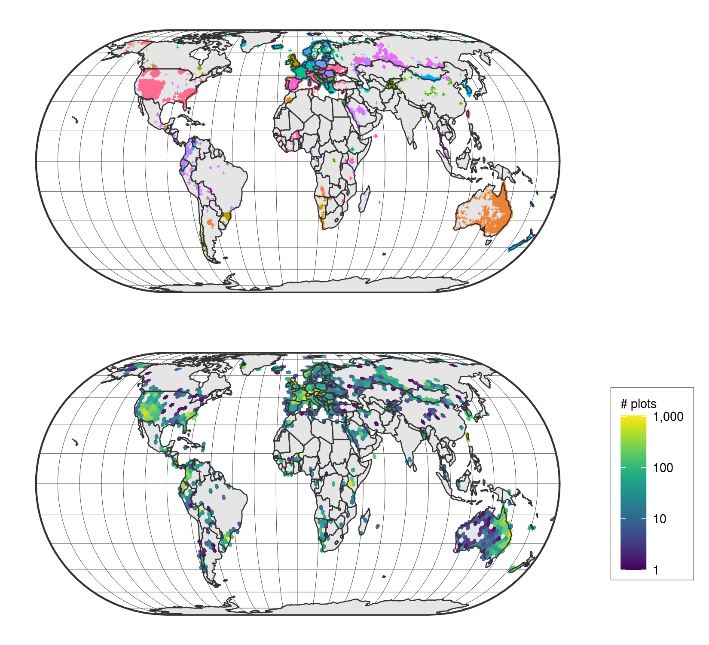

---
author-meta:
- Francesco Maria Sabatini
- Jonathan Lenoir
- Helge Bruelheide
bibliography:
- content/manual-references.json
date-meta: '2020-10-14'
header-includes: "<!--\nManubot generated metadata rendered from header-includes-template.html.\nSuggest improvements at https://github.com/manubot/manubot/blob/master/manubot/process/header-includes-template.html\n-->\n<meta name=\"dc.format\" content=\"text/html\" />\n<meta name=\"dc.title\" content=\"sPlot open - An environmentally-balanced, open-access, global dataset of vegetation plots \" />\n<meta name=\"citation_title\" content=\"sPlot open - An environmentally-balanced, open-access, global dataset of vegetation plots \" />\n<meta property=\"og:title\" content=\"sPlot open - An environmentally-balanced, open-access, global dataset of vegetation plots \" />\n<meta property=\"twitter:title\" content=\"sPlot open - An environmentally-balanced, open-access, global dataset of vegetation plots \" />\n<meta name=\"dc.date\" content=\"2020-10-14\" />\n<meta name=\"citation_publication_date\" content=\"2020-10-14\" />\n<meta name=\"dc.language\" content=\"en-US\" />\n<meta name=\"citation_language\" content=\"en-US\" />\n<meta name=\"dc.relation.ispartof\" content=\"Manubot\" />\n<meta name=\"dc.publisher\" content=\"Manubot\" />\n<meta name=\"citation_journal_title\" content=\"Manubot\" />\n<meta name=\"citation_technical_report_institution\" content=\"Manubot\" />\n<meta name=\"citation_author\" content=\"Francesco Maria Sabatini\" />\n<meta name=\"citation_author_institution\" content=\"German Centre for Integrative Biodiversity Research (iDiv) - Halle-Jena-Leipzig. Germany\" />\n<meta name=\"citation_author_institution\" content=\"Martin-Luther-Universit\xE4t Halle-Wittenberg, Institut f\xFCr Biologie, Am Kirchtor 1, 06108, Halle (Saale). Germany\" />\n<meta name=\"citation_author_orcid\" content=\"0000-0002-7202-7697\" />\n<meta name=\"twitter:creator\" content=\"@sPlot_iDiv\" />\n<meta name=\"citation_author\" content=\"Jonathan Lenoir\" />\n<meta name=\"citation_author_institution\" content=\"Unit\xE9 de Recherche \u201CEcologie et Dynamique des Syst\xE8mes Anthropis\xE9s\u201D (EDYSAN), UMR 7058 CNRS, Universit\xE9 de Picardie Jules Verne, 80037 Amiens Cedex 1, France\" />\n<meta name=\"citation_author_orcid\" content=\"0000-0003-0638-9582\" />\n<meta name=\"twitter:creator\" content=\"@EkoLogIt\" />\n<meta name=\"citation_author\" content=\"Helge Bruelheide\" />\n<meta name=\"citation_author_institution\" content=\"Martin-Luther-Universit\xE4t Halle-Wittenberg, Institut f\xFCr Biologie, Am Kirchtor 1, 06108, Halle (Saale). Germany\" />\n<meta name=\"citation_author_institution\" content=\"German Centre for Integrative Biodiversity Research (iDiv) - Halle-Jena-Leipzig. Germany\" />\n<meta name=\"citation_author_orcid\" content=\"0000-0003-3135-0356\" />\n<meta name=\"twitter:creator\" content=\"@HelgeBruelheide\" />\n<link rel=\"canonical\" href=\"https://fmsabatini.github.io/sPlotOpen_Manuscript/\" />\n<meta property=\"og:url\" content=\"https://fmsabatini.github.io/sPlotOpen_Manuscript/\" />\n<meta property=\"twitter:url\" content=\"https://fmsabatini.github.io/sPlotOpen_Manuscript/\" />\n<meta name=\"citation_fulltext_html_url\" content=\"https://fmsabatini.github.io/sPlotOpen_Manuscript/\" />\n<meta name=\"citation_pdf_url\" content=\"https://fmsabatini.github.io/sPlotOpen_Manuscript/manuscript.pdf\" />\n<link rel=\"alternate\" type=\"application/pdf\" href=\"https://fmsabatini.github.io/sPlotOpen_Manuscript/manuscript.pdf\" />\n<link rel=\"alternate\" type=\"text/html\" href=\"https://fmsabatini.github.io/sPlotOpen_Manuscript/v/891bc47301461b8de51cfd9962d46f5a3f58763c/\" />\n<meta name=\"manubot_html_url_versioned\" content=\"https://fmsabatini.github.io/sPlotOpen_Manuscript/v/891bc47301461b8de51cfd9962d46f5a3f58763c/\" />\n<meta name=\"manubot_pdf_url_versioned\" content=\"https://fmsabatini.github.io/sPlotOpen_Manuscript/v/891bc47301461b8de51cfd9962d46f5a3f58763c/manuscript.pdf\" />\n<meta property=\"og:type\" content=\"article\" />\n<meta property=\"twitter:card\" content=\"summary_large_image\" />\n<link rel=\"icon\" type=\"image/png\" sizes=\"192x192\" href=\"https://manubot.org/favicon-192x192.png\" />\n<link rel=\"mask-icon\" href=\"https://manubot.org/safari-pinned-tab.svg\" color=\"#ad1457\" />\n<meta name=\"theme-color\" content=\"#ad1457\" />\n<!-- end Manubot generated metadata -->"
keywords:
- markdown
- publishing
- manubot
lang: en-US
manubot-clear-requests-cache: false
manubot-output-bibliography: output/references.json
manubot-output-citekeys: output/citations.tsv
manubot-requests-cache-path: ci/cache/requests-cache
title: 'sPlot open - An environmentally-balanced, open-access, global dataset of vegetation plots '
...

<small><em>
This manuscript
([permalink](https://fmsabatini.github.io/sPlotOpen_Manuscript/v/891bc47301461b8de51cfd9962d46f5a3f58763c/))
was automatically generated
from [fmsabatini/sPlotOpen_Manuscript@891bc47](https://github.com/fmsabatini/sPlotOpen_Manuscript/tree/891bc47301461b8de51cfd9962d46f5a3f58763c)
on October 14, 2020.
</em></small>

## Authors

+ **Francesco Maria Sabatini** 
    {.inline_icon}
    [0000-0002-7202-7697](https://orcid.org/0000-0002-7202-7697)
    · {.inline_icon}
    [fmsabatini](https://github.com/fmsabatini)
    · {.inline_icon}
    [sPlot_iDiv](https://twitter.com/sPlot_iDiv) 
  <small>
     German Centre for Integrative Biodiversity Research (iDiv) - Halle-Jena-Leipzig. Germany; Martin-Luther-Universität Halle-Wittenberg, Institut für Biologie, Am Kirchtor 1, 06108, Halle (Saale). Germany
     · Funded by None
  </small>

+ **Jonathan Lenoir** 
    {.inline_icon}
    [0000-0003-0638-9582](https://orcid.org/0000-0003-0638-9582)
    · {.inline_icon}
    [lenjon](https://github.com/lenjon)
    · {.inline_icon}
    [EkoLogIt](https://twitter.com/EkoLogIt) 
  <small>
     Unité de Recherche “Ecologie et Dynamique des Systèmes Anthropisés” (EDYSAN), UMR 7058 CNRS, Université de Picardie Jules Verne, 80037 Amiens Cedex 1, France
     · Funded by None
  </small>

+ **Helge Bruelheide** 
    {.inline_icon}
    [0000-0003-3135-0356](https://orcid.org/0000-0003-3135-0356)
    · {.inline_icon}
    [HelgeBruelheide](https://twitter.com/HelgeBruelheide) 
  <small>
     Martin-Luther-Universität Halle-Wittenberg, Institut für Biologie, Am Kirchtor 1, 06108, Halle (Saale). Germany; German Centre for Integrative Biodiversity Research (iDiv) - Halle-Jena-Leipzig. Germany
     · Funded by None
  </small>

## Abstract {.page_break_before}

Vegetation provides the foundation of life on Earth.
Assessing biodiversity status and trends in plant communities is therefore critical to understand and quantify the effects of global change on ecosystems.
Here, we present the largest dataset of vegetation plots (i.e. species co-occurrence or community composition data) ever released in open access.
It contains information on 91,031 vegetation plots recording the cover or abundance of each plant species that occurs in a plot of a given surface area at the date of the botanical survey.
Plots were derived from 103 local to regional datasets. To improve the representation of Earth’s environmental conditions, plots were resampled from a larger pool of vegetation plots using an environmentally balanced sampling design.
Each vegetation plot comes with information on community-weighted means and variances of key plant functional traits.
Our open-access dataset can be used to explore global patterns of diversity at the plant community level, 
as ground truthing data in remote sensing applications or as a baseline for biodiversity monitoring. 

## Background & Summary {.page_break_before}

Biodiversity is facing a global crisis (@ISBN:978-3-947851-13-3). 
As many as 1 million species are estimated to be already facing extinction, mostly as a consequence of anthropogenic impacts, land-use and climate change (@ISBN:978-3-947851-13-3). 
The rates of biodiversity redistribution and homogenization are also accelerating (@doi:10.1038/s41559-020-1198-2; @doi:10.1038/s41559-020-1176-8). 
Biological assemblages are becoming progressively more similar to each other globally, as local biodiversity and endemic species go extinct and are replaced by introduced exotic species or by more widespread and competitive native species (@ISBN:978-3-947851-13-3; @doi:10.1038/s41559-020-1176-8). 
This has profound potential impacts on human and ecosystem health (@doi:10.1126/science.aai9214;  @doi:10.1111/brv.12344). 
For instance, many terrestrial and marine species are shifting their geographical distribution as a response to climate change (@doi:10.1038/s41559-020-1198-2), including animals hosting pathogens transmissible to humans (@doi:10.1038/nature06536; @doi:10.1016/j.ttbdis.2010.10.006; @doi:10.1126/science.1244325).  

Vegetation, i.e., the assemblage of plant species, is no exception to this biodiversity crisis (@doi:10.1126/science.1156831; @doi:10.3732/ajb.1000364; @doi:10.1038/s41559-020-1176-8). 
This is worrisome, since terrestrial vegetation accounts for 80% (450 Gt C) of the living biomass on Earth (Bar-On et al. 2018). Given the central role of vegetation in ecosystem productivity, stability and functioning (@doi:10.3732/ajb.1000364), assessing biodiversity status and trends in plant communities is paramount, for other life compartments and human societies alike.  

Monitoring plant biodiversity trends requires adequate data across a range of scales (@doi:10.1371/journal.pbio.3000183). 
Large independent collections of plant occurrence data do exist at the global or continental extent via the Botanical Information and Ecology Network (BIEN) (Enquist et al. 2016), the Global Inventory of Floras and Traits (GIFT) (@doi.org/10.1111/jbi.13623) or the Global Biodiversity Information Facility (GBIF) (https://www.gbif.org/). 
However, all these occurrence-only databases either neglect how individual plant species co-occur and interact locally to form plant communities, or are collected at spatial resolutions (e.g., one‐degree grid cells) which are too coarse to assess biodiversity trends at the most relevant scale of local plant communities (Boakes et al., 2010).  

Yet, there is a long-lasting tradition among botanists to record the cover or abundance of each plant species that occurs in a vegetation plot of a given size (i.e. surface area) at a given time. 
Compared to species-level data, vegetation-plot data present many advantages. 
First, they contain information on which plant species co‐occur together in the same locality at a given moment in time (@doi:10.1111/avsc.12191). 
This built-in feature of vegetation plots is a necessary prerequisite for testing hypotheses related to biotic interactions among plant species (i.e. plant-plant interactions). 
It can also provide crucial information on where and when a species is absent, therefore improving current species distribution models (@do:10.1890/07-2153.1). 
Being spatially explicit, vegetation plots can be resurveyed through time to assess potential changes in plant species composition relative to a baseline (Perring et al., 2018; Steinbauer et al., 2018, @doi:10.1038/s41559-020-1176-8). 
As they normally contain also information on the relative cover or abundance of each species, vegetation plots are more adequate to detect subtle biodiversity changes, compared to data based on the occurrence of individual species only (@doi:10.1111/j.1654-1103.2011.01318.x).  

Vegetation-plot data are very fragmented, though, as they typically stem from a myriad of research projects. 
As such, these data often suffer from the usual trade-off in biodiversity data: Collections have either fine-grain spatial resolutions but small spatial extents, or vice versa (@doi:10.1371/journal.pbio.3000183). 
Furthermore, with their disparate sampling protocols, standards and taxonomic resolutions, aggregating and harmonizing vegetation plot data proves extremely challenging (@doi:10.1038/s41559-018-0699-8). 
It is not surprising, therefore, that these data have only been rarely used in global‐scale biodiversity research until recently (@doi:10.1111/geb.12501; @doi:10.1111/jvs.12419).  

The sPlot initiative tries to close this data gap. 
It leverages on several existing local to regional vegetation-plot datasets, to create a harmonized and comprehensive global geo-database of terrestrial plant species assemblages (@doi:10.1111/jvs.12710). 
Established in 2013, sPlot currently contains more than 1.9 million vegetation plots, and is fully integrated with the TRY database (@doi:10.1111/gcb.14904), from which it derives information on plant functional traits. 
The sPlot database is increasingly being used to study continental- to global-scale vegetation patterns, such as the relative contribution of regional vs. local factors on the global patterns of fern richness (@doi:10.1111/jbi.13782), the mechanisms underlying the spread and abundance of native vs. invasive tree species (van der Sande et al. 2020), and worldwide trait–environment relationships in plant communities (@doi:10.1038/s41559-018-0699-8).  

Here, we provide a data set composed of 91,031 plots, which is representative of the environmental space covered by the sPlot database. 
Plots stem from 103 databases, and span across 115 countries (Figure {@fig:Figure1}). 
This resampled dataset (sPlot Open - hereafter) is composed of: 
(1) plot-level information, including metadata and basic vegetation structure descriptors; 
(2) the species composition of each vegetation plot, including species cover or abundance information when available; and 
(3) community-level functional diversity indices derived from the TRY database (@doi:10.1111/gcb.14904).  

{#fig:Figure1}

## References {.page_break_before}

<!-- Explicitly insert bibliography here -->

